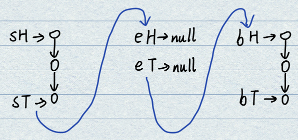

# 1.哈希表(HashSet & HashMap)
**特点**：哈希表增删改查所有操作的复杂度都是常数时间，但是是一个比较大的常数，比数组寻址大得多。可以理解为一种集合结构。Set和Map的唯一区别是有无伴随数据，底层结构是一回事。  
初级班只讲应用，中级班才会讲原理。遇到的题目一旦涉及到原理就是难题。  

- **C++的哈希表**：有多种称谓，例如UnOrderedMap、UnSortedMap、UnOrderedSet、UnSortedSet。其中Set和Map在结构上是没有区别的，Set中只有Key，而Map上有Key-Value。
- **Java的哈希表**：分为HashSet和HashMap，内容和上面保持一致。

**内存占用**：若key是基础类型，则哈希表构建时会直接拷贝此值，内部按值传递，例如整型和字符型；若key非基础类型（复杂结构体），则哈希表的key会存放此数据的内存地址，内部按引用传递，只占用8个字节。

- **Code**：
```java
import java.util.HashSet;
import java.util.HashMap;

public static class Node {
    public int value;
    public Node next;
    public Node(int val) { value = val; }
}

/* HashSet基本类型使用 */
HashSet<Integer> hashSet1 = new HashSet<>(); // 也可以是str类型
hashSet1.add(3);
hashSet1.contains(3); // true
hashSet1.remove(3);

/* HashSet复杂结构体类型使用 */
Node nodeA = new Node(1);
Node nodeB = new Node(1); // 注意两者虽然内容一致，但是内存位置不同，做为不同的键对待。
HashSet<Node> hashSet2 = new HashSet<>();
hashSet2.add(nodeA);
hashSet2.contains(nodeA); // true
hashSet2.remove(nodeA);

/* HashMap基本类型使用 */
HashMap<String, Integer> hashMap1 = new HashMap<>();
String str1 = "key";
String str2 = "key";
hashMap1.put(str1, 1); // 将键值对放进Map里
hashMap1.containsKey(str1); // true
hashMap1.containsKey(str2); // true，因为是基础类型，所以本质上是一样的。
hashMap1.get(str1);
hashMap1.get(str2);

/* HashMap复杂结构体类型使用 */
HashMap<Node, String> hashMap2 = new HashMap<>();
nodeA = new Node(1);
nodeB = new Node(1); // 两者虽然内容一致，但是内存位置不同
hashMap2.put(nodeA, "A节点");
hashMap2.put(nodeB, "B节点");
```

# 2.有序表(TreeSet & TreeMap)
**特点**：支持增删改查，所有操作的复杂度都是$O(\log{N})$级别。有序表和哈希表的区别是，有序表把key按照顺序组织起来，而哈希表完全不组织。  
**底层实现方法**：红黑树、AVL树、size-balance-tree、跳表。  

- **C++的有序表**：只有key，没有伴随数据value，叫做OrderedSet；既有key，又有伴随数据value，叫做OrderedMap；
- **Java的有序表**：TreeSet、TreeMap，底层结构实际是一回事。

**内存占用 & 排序依据**：若key是基础类型，则内部按值传递；若key为非基础类型（复杂结构体），必须提供比较器，则哈希表的key会存放此数据的内存地址，内部按引用传递，只占用8个字节。  

- **Code**：
```java
// 创建节点比较器
public static class NodeComparator implements Comparator<Node>{
    @Override
    public int compare(Node o1, Node o2){
        return o1.value - o2.value; // 若为负则保持顺序，若为正则颠倒次序==o1排在后面。
    }
}

/* 有序表HashSet复杂结构体类型使用 */
nodeA = new Node(5);
nodeB = new Node(3);
nodeC = new Node(7);
TreeSet<Node> treeSet = new TreeSet<>();
// treeSet.add(nodeA); // 这个命令会报错，因为没有在创建TreeSet的时候提供比较器
treeSet = new TreeSet<>(new NodeComparator());
treeSet.add(nodeA);
treeSet.add(nodeB);
treeSet.add(nodeC);

/* 有序表HashMap基础类型使用 */
TreeMap<Integer, String> treeMap1 = new TreeMap<>();
treeMap1.put(1, '我是1');
treeMap1.put(5, '我是5');
treeMap1.put(0, '我是0');
treeMap1.containsKey(5); // 检测是否存在此键值
treeMap1.get(5); // 获取value
treeMap1.firstKey(); // 获取最小key对应的value
treeMap1.lastKey(); // 获取最大key对应的value
treeMap1.floorKey(1); // key小于等于1中取最大key，对应的value
treeMap1.ceilingKey(5); // key大于等于5中取最小值key，对应的value
treeMap1.remove(5); // 删除节点
```

# 3.链表
单链表的节点结构如下所示，由此结构的节点依次连接起来所形成的链叫单链表结构。
```java
Class Node<V>{
    V value;
    Node next;
}
```
双链表的节点结构如下所示，由此结构的节点依次连接起来所形成的链叫双链表结构。单链表和双链表结构只需要给定一个头部节点head，就可以找到剩下所有的节点。
```java
Class Node<V>{
    V value;
    Node next;
    Node last;
}
```

- **关于链表的解题讨论**：  
对于笔试，不用太在乎空间复杂度，一切为了时间复杂度；  
对于面试，时间复杂度放在第一位，一定要找到空间最节省的方法。

- **链表重要技巧**：
1. 额外数据结构记录（哈希表等）、快慢指针SF。  
2. 使用快慢指针时一定要自己定制，因为涉及到F指针指向null时S指针压到哪一个元素。只是边界条件，和算法无关。  
3. while循环中可以先使用变量记录nex值，随后可以对head节点进行指针修改。


# 题08:基础题目-反转单向和双向链表
- **题目**：分别实现反转单向链表和反转双向链表的函数。要求如果链表长度为N，时间复杂度要求为O(N)，额外空间复杂度为O(1)。

- **分析**：此题目属于水题，完全就是一个coding问题。

- **注意**：链表函数需要注意是否要加返回值，若链表中有换头操作则需要返回头节点；若不涉及换头则可以返回void()。

<div align=center>

</div>

- **Code**：
```java
// 节点创建
public static class Node{
    public int value;
    public Node next;

    public Node(int data){
        this.value = data;
    }
}

// 创建一个单向链表
Node head1 = new Node(1);
head1.next = new Node(2);
head1.next.next = new Node(3); // 节点2的next默认是null

// 反转链表函数
public static Node reverseList(Node head){
    Node pre = null;
    Node last = null;
    while(head != null){ // 一直向下遍历，直到最后一个元素。head为当前节点。
        next = head.next; // 索引保存了head下一个节点，可以断开head.next链接了
        head.next = pre; // 改动head节点的指针，往上指
        pre = head; // head指针还没有变动过，给pre，为下一轮做准备
        head = next; // head执行+1操作
    }
    return pre; // 终止条件中，pre才是入口节点，head现在已经是null了
}
```

```java
// 双向链表节点创建
public static class DoubleNode{
    public int value;
    public DoubleNode last;
    public DoubleNode next;
    public DoubleNode(int data){
        this.value = data;
    }
}

// 创建一个双向链表
DoubleNode head2 = new DoubleNode(1);
head2.next = new DoubleNode(2);
head2.next.last = head2;
head2.next.next = new DoubleNode(3);
head2.next.next.last = head2.next;
head2.next.next.next = new DoubleNode(4);
head2.next.next.next.last = head2.next.next;

// 反转双向链表函数
public static DoubleNode reverseList(DoubleNode head){
    DoubleNode pre = null;
    DoubleNode nex = null;
    while(head != null){
        nex = head.next; // 先保存三个节点，为后续操作留下空间
        head.next = pre; // 此两行指令更改head节点的指向
        head.last = nex;
        pre = head; // 指针下移
        head = nex;
    }
    return pre;
}
```

# 题09:打印两个有序链表的公共部分
- **题目**：给定两个有序链表的头指针head1和head2，打印两个链表的公共部分。若两个链表的长度之和为N，时间复杂度要求为O(N)，额外空间复杂度要求为O(1)。

- **分析**：有点类似于Merge Sort中的外排序过程，谁小谁移动；相等了打印并且共同移动。一旦有一个越界了则停止。

- **Code**：
```java
public static void printCommonPart(Node head1, Node head2){
    while(head1 != null && head2 != null){ // 必须两个都非空，才进行判断
        if (head1.value == head2.value){
            System.out.println(head1.value + " ");
            head1 = head1.next;
            head2 = head2.next;
        } else if (head1.value < head2.value) {
            head1 = head1.next;
        } else {
            head2 = head2.next;
        }
    }
}
```

# 题10:判断一个链表是否为回文结构
- **题目**：给定一个单链表的头节点head，判断该链表是否为回文结构。若链表长度为N，时间复杂度达到O(N)，额外空间复杂度达到O(1)。

- **分析**：
笔试时可以直接使用栈结构，遍历链表且逐个压栈，之后逐个弹栈，两两对比；或者可以只对后半部分进行压栈，弹栈对比时可以省去一半的存储空间。  
然而单链表使用单指针只能一步一步往下遍历，无法知道何时开始压栈，因此可以使用快慢指针尽快获取到链表中点（慢指针每次+1，快指针每次+2）。  

面试时必须考虑额外空间复杂度O(1)。可以通过改动链表的方式实现：当找到中点之后，将后半部分的链表全部逆置，中间位置指向null。从始尾两个头节点开始遍历挨个判断。  

- **代码感想**：
手写了这三种实现方法，虽然链表最大的缺点是只能单向索引，但是最大的优点是可以自由改动其中的指针。可以方便地翻转整个链表，实现一些极其节省空间的做法。

<div align=center>

</div>

- **Code_V1 简单粗暴使用栈**
```java
public static boolean IsPalindromeList_V1(Node head){
    Node head_save = head;
    Stack<Node> stack = new Stack<>();
    while(head != null) { // 全部压栈
        stack.push(head);
        head = head.next;
    }
    while(head_save != null) { // 全部弹栈，若有一个不同则直接返回false
        if (head_save.value != stack.pop().value) {
            return false;
        }
        head_save = head_save.next;
    }
    return true;
}
```

- **Code_V2 使用栈但是存一半**
```java
public static boolean IsPalindromeList_V2(Node head) {
    /* 判断空链表和单个元素链表 */
    if (head == null || head.next == null) {
        return true;
    }
    
    /* 快慢指针找到链表中点（考虑奇数偶数情况，定制停止时所留位置） */
    int cnt = 1;
    Node S = head;
    Node F = head;
    while (F.next != null && F.next.next != null) { // 安全情况一直循环，到达边界条件
        S = S.next;
        F = F.next.next;
        cnt += 2; // 正常向后走
    }
    if (F.next == null) { // 单独分析偶数情况
        cnt++;
        F = F.next; // F来到末尾，S留在前中点
    }
    // 奇数情况，S在中间，F在末尾
    // 偶数情况，S在中间两个的前一个位置，留有余量，可以做到定制

    /* 后半个链表入栈 */
    S = S.next; // 无论奇数偶数，统一走到后中点位置
    Stack<Node> stack = new Stack<Node>();
    while (S != null) { // 后半部分全部压栈
        stack.push(S);
        S = S.next;
    }
    while (!stack.isEmpty()) { // 逐个弹栈比对，栈空则比较完
        if (head.value != stack.pop().value) {
            return false;
        }
        head = head.next;
    }
    return true;
}
```

- **Code_V3 空间O(1)方法**
```java
public static Node reverseList(Node head) {
    Node pre = null;
    Node nex = null;
    while(head != null) {
        nex = head.next;
        head.next = pre;
        pre = head;
        head = nex;
    }
    return pre;
}

public static boolean IsPalindromeList_V3(Node head) {
    /* 快慢指针找中点 */
    Node S = head;
    Node F = head;
    while(F.next != null && F.next.next != null) { // S可以到达前中点
        S = S.next;
        F = F.next.next;
    }
    
    /* 修改指针变成双向奔赴形状 */
    Node S_a = S.next; // 后中点s_after
    S_a = reverseList(S_a); // 反转，制作右链表
    // 注意，此处需要分别讨论奇数和偶数情况，但是因为我们选取的是后中点
    // 回文判断也只需要判断到end即可，所以选取后中点同时考虑了奇数偶数情况
    
    /* 依次判断是否对称 */
    boolean flag = true; // 默认是回文
    Node tempNode = S_a;
    while(tempNode != null) {
        if(tempNode.value != head.value) {
            flag = false; // 一旦一个不一致就是否
            break;
        }
        tempNode = tempNode.next;
        head = head.next;
    }
    
    /* 重新接回原始链表，返回结果 */
    S_a = reverseList(S_a); // 右链表反转，变回原来形状
    return flag;
}
```

# 题11:链表的荷兰国旗问题
- **题目**：将单向链表按某值划分成左边小、中间相等、右边大的形式。给定一个单链表的头节点head，节点的值类型为整型，再给定一个整数pivot。实现一个调整链表的函数，实现链表的划分。要求三个区域内相对位置关系不变，时间复杂度O(N)，额外空间复杂度O(1)。

- **分析**：如果是笔试题，在不考虑额外空间复杂度时，可以先将链表拆成Node数组，之后直接partion，再把一系列节点串起来。  
如果是面试题，则需要考虑额外空间复杂度。左神的方法为：构建6个变量，分别为start_h, start_t, equal_h, equal_t, big_h, big_t，初始全部设定为null。遍历整个链表，根据值的大小关系依次放入三个区域中，调整域内节点指向关系和六个指针指向关系。遍历完成之后将三个域串起来即可完成，串连过程中需要考虑各个区域是null的特殊情况。

- **注意**：快排的partiton过程因为存在交换，会导致稳定性丧失。而链表的partion过程中，每个节点有指向下一个节点的指针，所以不会丧失稳定性。  

- **重要技巧**：链表在遍历时，while下第一句可以首先使用nex暂存cur后的变量，这样就可以对cur的指针进行随意操作，while临结束的时候使用nex节点幅值cur即可。

<div align=center>

</div>

<div align=center>

</div>

- **Code_V1 直接数组partition**
```java
public static Node listPartition_V1(Node head, int pivot) {
    if (head == null) {
        return null;
    }
    
    /* 转化成节点数组 */
    Node cnt_node = head;
    int cnt = 0;
    while(cnt_node != null) { // 统计长度
        cnt++;
        cnt_node = cnt_node.next;
    }
    Node[] nodelist = new Node[cnt];
    cnt_node = head;
    for(int i=0; cnt_node != null; i++) {
        nodelist[i] = cnt_node;
        cnt_node = cnt_node.next;
    }
    
    /* 开始partition */
    nodelist = partition(nodelist, pivot);
    
    /* 数组连成链表 */
    int i = 0;
    for(; i < nodelist.length-1; i++) {
        nodelist[i].next = nodelist[i+1];
    }
    nodelist[i].next = null;
    
    return nodelist[0];
}

public static Node[] partition(Node[] nodelist, int pivot) {
    int L = -1;
    int R = nodelist.length;
    int i = 0;
    while (i < R) {
        if(nodelist[i].value < pivot) { // 出现小值，i和L都增长
            L++;
            i++;
        } else if (nodelist[i].value > pivot) { // 出现大值，和R边界元素交换，i不动
            swap(nodelist, --R, i);
        } else { // 否则出现等于情况，指针自增
            i++;
        }
    }
    return nodelist;
}

public static void swap(Node[] nodelist, int i, int j) {
    Node temp = nodelist[i];
    nodelist[i] = nodelist[j];
    nodelist[j] = temp;
}
```

- **Code_V2 额外空间O(1)方法**
```java
public static Node listPartition_V2(Node head, int pivot) {
    /* 创建6个变量，记录每一个区域的开始和结束 */
    Node small_h = null;
    Node small_t = null;
    Node equal_h = null;
    Node equal_t = null;
    Node big_h = null;
    Node big_t = null;
    Node nex = null; // 暂存节点

    /* 遍历链表，同时三个区域节点入库 */
    while (head != null) {
        nex = head.next;
        head.next = null; // 因为总是放置于最后，所以先置空
        if (head.value < pivot) {
            if (small_h == null) { // 创建首个节点，h和t均指向首个节点
                small_h = head;
                small_t = head;
            } else { // 新增第2+节点
                small_t.next = head; // 末尾指向后缀节点
                small_t = head; // 更新末尾
            }
        } else if (head.value == pivot) {
            if (equal_h == null) {
                equal_h = head;
                equal_t = head;
            } else {
                equal_t.next = head;
                equal_t = head;
            }
        } else {
            if (big_h == null) {
                big_h = head;
                big_t = head;
            } else {
                big_t.next = head;
                big_t = head;
            }
        }
        head = nex;
    }

    /* 开始串联三个区域，考虑特殊情况 */
    // 这个融合逻辑是真的绝了
    
    // 只要有小域，可以实现直接去和=相连，吃掉等于区域
    // 若有小域：sH->sT eH->eT 变成：sH->eT
    // 若没有小域：直接跳过，不做出任务连接操作，链表变为 eH->eT
    if (small_t != null) { 
        small_t.next = equal_h;
        equal_t = equal_t == null ? small_t : equal_t;
    }
    // 判断有没有等域
    // 若有等域，?->eT 变成：?->bT
    if (equal_t != null) {
        equal_t.next = big_h;
    }
    
    // 逐层筛查，挑选出第一个不为null的链表起始
    return small_h != null ? small_h : (equal_h != null ? equal_h : big_h);
}
```

# 题12:具有随意指针的链表复制问题
- **题目**：一种特殊的单链表节点类描述如下。rand指针是单链表节点结构中新增的指针，rand可能指向链表中的任意一个节点，也可能指向null。给定一个由Node节点类型组成的无环单链表的头节点head，实现一个函数完成这个链表的复制，并返回复制的新链表的头节点。要求时间复杂度O(N)，额外空间复杂度O(1)。
```java
Class Node{
    int value;
    Node next;
    Node rand;
    Node(int val){
        value = val;
    }
}
```

- **分析**：*不考虑额外空间情况下（笔试场景）*，可以使用哈希表完成。  
(1) 按照next指针遍历旧链表，将旧的Node做为key，新的Node拷贝节点做为value构成哈希表。  
(2) 之后依次修改新链表的next和rand指针。遍历老链表，Tab[Node1] = Node1'，使Node1'.next指向Tab[Node1.next]节点；Node1'.rand指向Tab[Node1.rand]节点。最终返回头节点。  
*考虑额外空间复杂度情况下（面试场景）*，不使用哈希表，可以用一种比较秀的方法。在老链表的next位置插入新节点。通过成对分析方法修改新节点的rand指向。此思路通过相邻位置一一对应的关系替代了哈希表的功能。

- **编程感想**：列表因为是单向索引，所以while循环内第一步都是先记录nex节点信息，之后可以对cur节点进行修改，循环最后使得cur=nex。一定要注意链表末尾的null，有时需要考虑特殊情况手动置空。

<div align=center>

</div>

- **Code_V1 基于哈希表**：
```java
public static Node copyListWithRand1_(Node head) {
    if (head == null) { return null; }
    
    /* 创建出来所有的新节点，放入Map中 */
    HashMap<Node, Node> map = new HashMap<Node, Node>();
    Node temp = head;
    while(temp != null) {
        Node newNode = new Node(temp.value);
        map.put(temp, newNode);
        temp = temp.next;
    }
    
    /* 遍历节点，整理next指针、rand指针 */
    temp = head;
    while(temp != null) {
        map.get(temp).next = map.get(temp.next); // 得到新节点
        map.get(temp).rand = map.get(temp.rand); // 得到新节点
        temp = temp.next;
    }
    return map.get(head);
}
```

- **Code_V2 串联链表-空间O(1)方法**：
```java
public static Node copyListWithRandV2(Node head) {
    if (head == null || head.next == null) {
        return null;
    }
    Node nex = null;
    
    /* 新增并且插入节点 */
    Node cur = head;
    while(cur != null) {
        // 存储旧链表当前节点、下一节点
        nex = cur.next;
        // 创建&插入新节点
        cur.next = new Node(cur.value);
        cur.next.next = nex;
        // 指针后移
        cur = nex;
    }
    
    /* 更改rand指针 */
    cur = head;
    while(cur != null) {
        // 改动新节点的rand指针，充分利用新旧节点之间的两两对应关系。考虑特殊的null情况，
        cur.next.rand = cur.rand == null ? cur.rand : cur.rand.next; 
        // 指针后移两步
        cur = cur.next.next;
    }
    
    /* 还原原始链表 */
    cur = head;
    Node new_node = null;
    Node new_start = head.next; // 锁定新链表起始位置
    while(cur.next.next != null) { // 若下一个节点不是末尾，则一定有新、旧节点
        // 存储新链表节点、旧链表下一个节点
        new_node = cur.next;
        nex = cur.next.next;
        // 串联新链表
        new_node.next = nex.next; 
        // 还原旧链表
        cur.next = nex; 
        // 完成指针后移
        cur = nex;
    }
    // 处理旧链表尾部
    cur.next = null;
    
    return new_start;
}
```

# 题13:链表入环节点查找(题14的前置问题)
- **题目**：链表存在回环，需要返回第一个入环的位置，封装成为`getLoopNode`函数。

- **分析**：一个单链表如果一直走能走到null，则一定是无环的。若有环则一定会在环内兜圈子且永远不会出圈。解法可以分为两种，一种是使用额外数据结构的方法；一种是不借助额外数据结构，只使用有限个变量实现的方法。

- **方法1**：基于哈希表Set，每次遍历一个节点，若未出现过则放入集合；若出现首个重复，则说明遍历已经在回环中循环了一圈。此重复节点即使首个入环节点。

- **方法2**：不基于哈希表Set，只使用有限变量实现首个入环节点检测。使用快慢SF指针策略，若快指针走到了null则说明链表无环。以下步骤为有环的情况：  
(1) 慢指针每次走1步，快指针每次走2步；  
(2) 当S和F相遇的时候，S不变，F指针指向开头，并且将步长更改为1；  
(3) S和F指针一起单步运行，相遇位置即是首个入环节点。  
注意：因为起始状况中F指针比S快一倍，那么2圈以内F一定能追上S，所以遍历时时间复杂度一定是O(N)级别。这个魔性的方法也可以去证，但是比较麻烦，建议直接记住这个结论，可以直接使用。

- **Code_V1 基于HashSet**：
```java
public static Node getLoopNode_V1(Node head) {
    if(head == null && head.next == null) {
        return null;
    }
    HashSet<Node> hashSet = new HashSet<Node>();
    while(head != null) { 
        if(hashSet.contains(head)) { // 找到了第一个重复位置，直接返回
            return head;
        }
        hashSet.add(head);
        head = head.next;
    }
    return null;
}
```

- **Code_V2 基于快慢指针**：
```java
public static Node getLoopNode_V2(Node head) {
    /* 筛查是否有空链表、单节点、双节点状况 */
    if(head == null || head.next == null || head.next.next == null) {
        return null;
    }
    
    /* 初始化先使两个指针错开，前面筛查提供了保障，这两行一定不出错 */
    Node S = head.next;
    Node F = head.next.next;
    
    /* 开始寻找j追上i的位置 */
    while(S != F) {
        if(F.next == null || F.next.next == null) {
            return null; // 若发现j能够索引到null，则是无环链表
        }
        S = S.next;
        F = F.next.next;
    }
    
    /* 复位F指针，同步向下走，再次相遇则为入环节点 */
    F = head;
    while(S != F) {
        S = S.next;
        F = F.next;
    }
    return S;
}
```

# 题14:两链表相交系列问题(链表中最难的题目)
- **题目**：给定两个可能有环也可能无环的单链表，头节点head1和head2。请实现一个函数，若两链表相交则返回相交的第一个节点。如果不相交返回null。两链表长度之和为N，时间复杂度达到O(N)，额外空间复杂度达到O(1)。

- **分析**：此题目的状况非常复杂，需要详尽地列举每一种场景进行分析。  
1. 使用`getLoopNode`函数分别获取两个链表的入环节点`loop1`和`loop2`，两个节点可能为null/not null。  
2. 分类讨论*情况1*中`loop1=null`且`loop2=null`，说明两个链表均是线状无环，这样两个链表不可能相交再岔开，只可能是完全不相交或相交节点之后全部共有。为了区分这两个子情况，找出两个链表的末尾节点地址end1和end2，若地址不同则一定不相交；若地址相同则一定相交。为了超出相交节点，可以使用长度差值法寻找（len1记录链表1长度，len2记录链表2长度。长链表从差值步|len1-len2|开始走，短链表从第一个节点开始周，逐个判断节点是否内存地址相同，第一个相同的则为相交节点。）  
3. 分类讨论*情况2*中`loop1!=null`且`loop2=null`，说明一个链表有环、一个无环。这种情况下两个链表不可能相交。  
4. 分类讨论*情况3*中`loop1!=null`且`loop2!=null`，说明两个链表都有环。可以细分为三种情况：各自独立成环、入环节点为同一个、入环节点是环内的不同位置。  
    - 第二种情况最容易区分，入环节点相同则`loop1 == loop2`，使用长度差值法寻找出此节点；  
    - 第一&三情况可以使用空转法区别，让`loop1`转一周，在转回到自己之前遇到了`loop2`则是第三种情况，没有遇到`loop2`则是第二种情况。

- **总结**：此方法中所有的操作时间复杂度都是O(N)，每种方法都使用有限几个变量，没有用到哈希表等任何一个大的数据结构。  

<div align=center>

</div>

```java
// 情况1：两个都是无环链表
public static Node noLoop(Node head1, Node head2) {
    // 统计长度 && 找到终止点
    Node end1 = head1;
    Node end2 = head2;
    int len1 = 1;
    int len2 = 1;
    while (end1.next != null) {
        len1++;
        end1 = end1.next;
    }
    while (end2.next != null) {
        len2++;
        end2 = end2.next;
    }
    if (end1 != end2) { // 若两者不一致，一定无公共节点
        return null;
    }

    // 确定相交，使用差值法寻找相交位置
    Node longList = len1 > len2 ? head1 : head2;
    Node shortList = !(len1 > len2) ? head1 : head2;
    int delta = Math.abs(len1 - len2);
    while (delta != 0) { // 先走特定步
        longList = longList.next;
        delta--;
    }
    while (longList != null) { // 两个一起单步走，遇到第一个相等的返回
        if (longList == shortList) {
            return shortList;
        }
        longList = longList.next;
        shortList = shortList.next;
    }
    return null;
}

// 情况2：两个都有环
public static Node bothLoop(Node loop1, Node loop2) {
    // 子情况1：两个有环链表在同一个点入环
    if (loop1 == loop2) {
        return loop1;
    }
    // 子情况2：两个链表无任何关联 & 子情况2：两个链表在不同位置入环
    Node start = loop1;
    loop1 = loop1.next;
    while (loop1 != start) { // 在表1的环内循环一圈，找有没有loop2
        if (loop1 == loop2) { // 如果在环内找到了loop2，则返回其中一个
            return loop1;
        }
        loop1 = loop1.next;
    }
    return null; // 如果循环一圈找不到loop2，则没有相交
}

public static Node getFirstCrossNode(Node head1, Node head2) {
    /* 处理单空情况 */
    if(head1 == null || head2 == null) { return null; }

    /* 分别找到两个链表的入环节点 */
    Node loop1 = getLoopNode(head1);
    Node loop2 = getLoopNode(head2);

    /* 情况1：两个都是无环链表 */
    if (loop1 == null && loop2 == null) {
        return noLoop(head1, head2);
    }

    /* 情况2：两个都有环 */
    if (loop1 != null && loop2 != null) {
        return bothLoop(loop1, loop2);
    }

    /* 情况3：一个有环一个无环，不可能相交 */
    return null;
}
```

