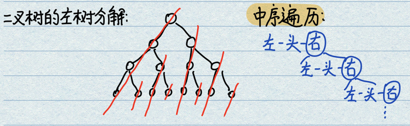

# 1.二叉树三种遍历
二叉树遍历方法中最容易的就是递归形式，但是也要掌握非递归的遍历。  
- **叶节点**：左右孩子均为null。  
- **根节点/头节点**：最顶端的节点。  
- **递归序的概念**：关于每个节点的三次回顾。  
<div align=center>

</div>

```java
/* 递归序的基本概念 */
/*  递归方法实现二叉树的遍历可以回到每个节点三次。
    虽然可能什么都没干，但是每个节点可以回三次 */
public static void f(Node head){
    // 1 第一次来到一个节点的时候的操作空间
    if (head == null){ return; }
    // 1

    f(head.left); // 处理完左树之后
    // 2 这个时候第二次回到了自己，有一个操作空间
    // 2 

    f(head.right); // 处理完右树之后
    // 3 这个时候第三次回到了自己，有一个操作空间
    // 3 
}
```

**递归序视角下的三种遍历**：利用递归行为三次能够到达自己，但是选择打印的时机不同，可以实现。  
- **先序遍历**：对于每一颗子树而言，都是头-左-右的打印顺序。递归序中第1次遇到节点则打印。
- **中序遍历**：对于每一颗子树而言，都是左-头-右的打印顺序。递归序中第2次遇到节点则打印。
- **后序遍历**：对于每一颗子树而言，都是左-右-头的打印顺序。递归序中第3次遇到节点则打印。

```java
public static void preOrderRecur(Node head){
    if (head == null){ return; } // 若为空节点直接返回
    System.out.println(head.value + " "); // 前序遍历，递归序中第一次遇到进行打印
    preOrderRecur(head.left);
    preOrderRecur(head.right);
}
public static void inOrderRecur(Node head){
    if (head == null){ return; }
    inOrderRecur(head.left);
    System.out.println(head.value + " "); // 中序遍历，递归序中第二次遇到进行打印
    inOrderRecur(head.right);
}
public static void postOrderRecur(Node head){
    if (head == null){ return; }
    postOrderRecur(head.left);
    postOrderRecur(head.right);
    System.out.println(head.value + " "); // 后续遍历，递归序中第三次遇到进行打印
}
```

# 2.二叉树树型DP常用框架
当在求解一个二叉树问题时，在可以向左树要信息、向右树要信息的情况下，进行可能性的罗列。  
此框架可以解决一切`树型DP`问题，即在树上进行动态规划，融合左右子树提供的信息加工出自己的信息往上传递（能把自己的问题给解了），唯一的难度在于可能性的罗列。  

- **问题**：是否二叉树问题都可以用这个框架？  
具体问题具体分析，只要是二叉树树型DP问题都能处理，但是有一些特殊问题无法解决，例如获取二叉树中的中位数。一般面试过程中都不太会问那些不好优化、只能用暴力解的方法，因为没有区分度。

- **实现形式**：
```java
/* 步骤1：定义返回信息类 */
public static class ReturnType{
    public boolean flag;
    public int a;
    public ReturnType(boolean flag_init, int a_init){ // 构造函数
        flag = flag_init;
        a = a_init;
    }
}

/* 步骤2：递归过程 */
public static ReturnType process(Node x){
    // --- 1、设定basecase，即最末层的情况
    if (x == null){
        return new ReturnType(true, 0);
    }
    // --- 2、递归调用，分别处理左右子树并获取全部信息
    ReturnType leftData = process(Node x.left);
    ReturnType rightData = process(Node x.right);

    // --- 3、可能性罗列，根据子树信息加工本节点信息
    boolean flag = false; // 设计生成逻辑
    int a = 0; // 设计生成逻辑

    // --- 4、向上一层返回全部信息
    return new ReturnType(flag, a);
}

/* 步骤3：调用递归函数，获取最终结果 */
public static boolean Function(Node head){
    return process(head).flag;
}
```

# 题15:二叉树的三种非递归遍历
- **题目**：不使用递归，实现先序、中序、后序三种遍历。  
- **分析**：任何递归都可以改成非递归，因为递归本质上是系统帮你自动压栈，改为手动压栈就是非递归。  

- **先序遍历**：
    - 准备一个Stack，将根节点压栈；
    - 开始循环处理，弹栈打印节点head（处理）；
    - 分别压栈右孩子、左孩子，如果有的话；（因为压栈是头-右-左，出来的时候是头-左-右，符合先序）
    - 一直循环，直到栈空。
<div align=center>

</div>

- **中序遍历**：每棵子树整棵树左边界进栈，依次弹出且打印，对弹出节点的右树进行循环处理。
    - 左侧节点全部入栈，直到没有左节点；
    - 开始弹栈，打印，同时对右侧树进行压栈；
    - 一直循环，直到栈空。  
    分析：为什么这种先左再头，之后对右树再先左再头的方式可以实现中序遍历？因为整棵树可以被分解为左数的组合。此视角下，遍历顺序左头(左头(左头右))可以分解掉整棵树。这样对任何一颗子树都是左头右，因此整体是中序遍历。
<div align=center>

</div>

- **后序遍历**：
    - 准备两个Stack，将根节点压栈1；
    - 开始循环处理，弹栈1，打印节点head，将head压栈2；
    - 分别压栈1左孩子、右孩子，如果有的话；（栈1压栈是头-左-右，栈2压栈是头-右-左，栈2出栈是左-右-头，符合后序）
    - 一直循环，直到栈空，栈2全部出栈即为后序遍历。  
<div align=center>

</div>

- **Code_1 非递归先序遍历**
```java
public static void preOrderUnRecur(Node head) {
    // 程序的眼睛，排除意外情况，什么时候都不能忘掉
    if(head == null) { return ; }

    Stack<Node> stack = new Stack<>();
    stack.push(head); // 将头节点压栈
    while(!stack.isEmpty()) { // 循环处理直到栈空
        Node cur = stack.pop(); // 弹栈打印
        System.out.print(cur.value + " ");
        /* 注意这里的左右顺序 */
        if (cur.right != null) { // 右孩子先入栈，因为最终出栈时右应该后出栈
            stack.push(cur.right);
        }
        if (cur.left != null) { // 左孩子后入栈，因为最终左孩子先出栈。
            stack.push(cur.left);
        }
    }
}
```

- **Code_2 非递归中序遍历(这个的程序有点难写)**
```java
public static void inOrderUnRecur(Node head) {
    if(head == null) { return ; }
    Stack<Node> stack = new Stack<Node>();
    
    // ！！！这里的条件写法是真的绝了，复杂的逻辑使用巧妙的循环和判断实现。
    // 这种写法允许指针head指向null，以此可以判断是否要进行出栈。
    while(!stack.isEmpty() || head != null) {
        if(head != null) { // 向左走到底，一路压栈
            stack.push(head);
            head = head.left;
        } else { // 左节点走完，指向最左侧节点的左侧null
            head = stack.pop(); // 一旦到了null，弹出最后压栈节点，即中节点
            System.out.print(head.value + " "); // 弹出即打印
            head = head.right; // 弹出同时将指针指向此节点的右孩子，执行相同的操作
        }
    }
}
```

- **Code_2 非递归后序遍历**
```java
public static void posOrderUnRecur1(Node head) {
    if(head == null) { return ; }
    Stack<Node> s1 = new Stack<Node>();
    Stack<Node> s2 = new Stack<Node>();
    s1.push(head);
    while(!s1.isEmpty()) {
        Node cur = s1.pop(); // s1弹栈
        s2.push(cur); // s2直接入栈，最先入此栈的一定是头节点
        /* 入栈是先左后右，弹栈时是先右后左 */
        if(cur.left != null) {
            s1.push(cur.left);
        }
        if(cur.right != null) {
            s1.push(cur.right);
        }
    }
    while(!s2.isEmpty()) { // 逐个弹栈，此时是先左后右，最终是头节点
        System.out.print(s2.pop().value + " ");
    }
}
```

# 题16:完成二叉树宽度优先遍历
- **题目**：实现二叉树的宽度优先遍历，即按照层次从左向右依次打印。
- **分析**：宽度遍历用`队列`，通过循环结构控制队列的出入进程，实现从左到右的打印。一个节点出队列的同时完成相关节点的入队列操作。
- **流程**：
    - 头节点入队列；
    - 出队列，打印，同时将此节点的左、右孩子分别入队列；
    - 循环往复直到队列空。  
    分析：这样的做法使得每一层结束的时候，总是能从左到右地将下一层的所有节点入队列。

- **Code**：
```java
public static void widthOrder(Node head){
    if (head == null){ return ; }
    /* 双链表就是一个队列 */
    LinkedList<Node> queue = new LinkedList<Node>();
    queue.add(head);
    while(!queue.isEmpty()){ // 循环直到队列为空
        head = queue.poll(); // 弹出节点，进行记录，对此节点的左右孩子进行操作
        System.out.print(head.value + " ");
        /* 如果有左右节点，再进行分别添加。需要考虑叶子节点的状况 */
        if(head.left != null) {
            queue.add(head.left);
        }
        if(head.right != null) {
            queue.add(head.right);
        }
    }
}
```

# 题17:求一颗二叉树的最大宽度(基于宽度优先遍历)

- **分析**：遍历层的时候（宽度优先遍历），要知道自己在第几层，而且能统计自己层内的节点数量。可以创建一个哈希表，记录每个节点在第几层，一旦节点入表则层位置信息不可修改。创建三个变量：目前统计所在层curLevel、目前统计层节点数量curLevelNodes、全局最大值max。

- **流程V1(基于哈希表)**：
    - 在弹出一个节点的同时，判断此节点是否还处于当前统计层，若在则curLevelNodes数量加1，若不在则进行当前层结算且为遍历下一层进行准备；
    - 若有左孩子，左孩子节点入队列，且将此节点的层数记录在Map中；
    - 若有右孩子，右孩子节点入队列，且将此节点的层数记录在Map中；  
    注意：弹出节点为需要分析的节点，一方面判断此节点是否标记一层结束；一方面在孩子入队列时使用哈希表进行层数记录。

- **Code_V1 哈希表**：
```java
public static int getMaxWidth_(Node head) {
    if (head == null) {
        return 0;
    }
    /* 队列创建与头节点添加 */
    LinkedList<Node> queue = new LinkedList<Node>();
    queue.add(head); // 添加头节点
    
    /* 创建哈希表，记录每个节点所在的层数 */
    HashMap<Node, Integer> layerRec = new HashMap<>();
    layerRec.put(head, 1);
    
    /* 初始条件，head节点层数记录、计数清零 */
    int curLevel = 1;
    int curLevelCnt = 0;
    int max = Integer.MIN_VALUE;
    
    while(!queue.isEmpty()) {
        /* 捕获出队列节点，并进行考察 */
        Node cur = queue.poll();
        if(layerRec.get(cur) == curLevel) { // 在当前层
            curLevelCnt++; // 当前层节点数量自增
        } else { // 来到了下一层的第一个节点，开始结算上一层
            // max = Math.max(curLevelCnt, max); // 结算最后一层（但是会出现最后一层无法结算的情况，需要特殊考虑）
            curLevelCnt = 1; // 清空，为下一层做准备
            curLevel++; // 已经达到了下一层
        }
        
        /* 依次添加左右节点，并且记录层数 */
        System.out.print(cur.value + " "); // 中序遍历的打印
        if(cur.left != null) {
            queue.add(cur.left);
            layerRec.put(cur.left, curLevel + 1);
        }
        if(cur.right != null) {
            queue.add(cur.right);
            layerRec.put(cur.right, curLevel + 1);
        }
        
        // 可以将更新位置放在这里，每遍历完一个节点刷新一次，保证不遗落每一个节点
        max = Math.max(curLevelCnt, max);
    }
    System.out.println();
    return max;
}
```

- **流程V2(不基于哈希表)**：
宽度遍历的过程中，队列中的特点是同一层的节点会紧紧地挨在一起，但是难点在于顶点出队列的时候下层节点才会入队列。可以利用这个特点实现非哈希表的宽度统计。左神给出的方案中 

- **Code_V2 单变量**：
```java
public static int getMaxWidth2(Node head) {
    if(head == null) { return 0; }
    
    /* 整体策略：使用指针标记开始和结束，完成逐层统计 */
    LinkedList<Node> queue = new LinkedList<Node>();
    queue.add(head);
    Node p1 = head; // 总是指向当前层结束节点，通过p2进行更新
    Node p2 = null; // 总是指向下一层末尾节点，通过左右孩子入队列进行更新
    int curLevelCnt = 0;
    int max = -1;
    
    while(!queue.isEmpty()) {
        head = queue.poll();
        System.out.print(head.value + " ");
        curLevelCnt++; // 弹出一个，则当前层数量+1
        
        /* 左右孩子入队列，p2指针总是指向最后入队列节点 */
        if(head.left != null)
            queue.add(head.left);
            p2 = head.left;
        if(head.right != null)
            queue.add(head.right);
            p2 = head.right;
        
        /* 到达此层末尾，结算节点。为下一层清零 */
        if (head == p1) { // 考察节点和当前层的末尾指针重合，说明当前层结束
            max = Math.max(max, curLevelCnt); // 捕获此层节点数量
            p1 = p2; // 捕获新层，最后节点
            curLevelCnt = 0; // 新层计数清零
        }
    }
    System.out.println();
    return max;
}
```

- **流程V3(单层处理)**：
无论是左神讲的V1还是V2，都是基于单个节点的分析方法，有多少个节点就要进行多少次弹栈与节点分析操作。交流群的网友给出了自己的解法，即在每一层内使用一个for循环进行单层出栈与下一层压栈。这样处理周期就从单个节点扩展到了单个层。代码清晰简介。  
得到的启发就是，某一个数据结构本身很简单，但是配合上复杂的逻辑控制就能实现很多功能。要注意数据结构内部数据之间的尺寸、顺序关联。
- **Code_V3 层处理**：
```java
public static int getMaxWidth_(Node head) {
    if (head == null) { return 0; }
    LinkedList<Node> queue = new LinkedList<Node>();
    queue.add(head);
    int max = Integer.MIN_VALUE;
    
    /* 此while是按层为单位进行循环，而非以单个节点为单位 */
    while (!queue.isEmpty()) {
        int size = queue.size(); // 计算队列的尺寸，后续出队列的节点数，即为一层的节点数量
        max = Math.max(max, size); // 更新max
        /* 将固定尺寸的节点全部出队列，同时将左右孩子入队列，构造下一层节点集合 */
        for (int i = 0; i < size; i++) { 
            head = queue.poll();
            System.out.print(head.value + " ");
            if (head.left != null)
                queue.add(head.left);
            if (head.right != null)
                queue.add(head.right);
        }
    }
    return max;
}
```

# 题18:判断搜索二叉树(Binary Search Tree)
- **分析**：对于每一颗子树，左树节点都比根节点小，右树节点都比根节点大。一颗经典的搜索二叉树中是没有重复值的。
<div align=center>

</div>

- **基本方法1-递归中序遍历**：中序遍历得到的序列必须全部为升序。递归写法中逻辑处理部分应该放到递归的中间部分。
```java
/* 方法1：中序遍历递归过程中完成判断 */
public static int curMAX = Integer.MIN_VALUE; // 记录当前最大值
public static boolean isBST(Node head) {
    // base case，到达叶子节点的左右空树，返回true
    if(head == null) { return true; }
    boolean leftIsBST = isBST(head.left);
    
    // 若 （左侧不是BST） 或者 （此节点值 <= 左侧最大值）
    if(!leftIsBST || head.value <= curMAX) {
        return false;
    }
    curMAX = head.value; // 考察head结束，左侧合规，更新当前最大值
    
    return isBST(head.right); // 此时取决于右侧是否为BST
}

/* 方法2：傻白甜方式，获取整个中序遍历列表，判断整个列表是否为升序 */
public static boolean isBSTList(Node head) {
    LinkedList<Node> inOrderList = new LinkedList<Node>();
    // 递归获取中序遍历
    process(head, inOrderList); 
    // 遍历所有节点，升序检查
    int curNum = Integer.MIN_VALUE;
    while(!inOrderList.isEmpty()) {
        Node curNode = inOrderList.poll();
        if (curNum <= curNode.value) { // 发现降序或平序
            return false;
        }
        curNum = curNode.value;
    }
    return true;
}
```

- **基本方法2-非递归中序遍历**：中序遍历得到的序列必须全部为升序。
```java
/* 方法3：非递归中序遍历，动态判断序列是否为升序 */
public static boolean isBST(Node head) {
    if (head == null) { return false; }
    Stack<Node> stack = new Stack<>();
    int curMax = Integer.MIN_VALUE;
    while(!stack.isEmpty() || head != null) {
        // 若有左孩子，循环入栈直到空
        if(head != null) {
            stack.add(head);
            head = head.left;
        } else { // 若无右孩子，开始弹栈
            head = stack.pop();
            if (head.value <= curMax) {
                return false;
            }
            curMax = head.value; // 更新值
            head = head.right;
        }
    }
    return true;
}
```

- **递归框架方法**：节点x可以向自己的左树要信息、可以向自己的右树要信息，并且结合获取到的信息得出自己的信息。若x满足以下四个条件才能进行判断：
    - **左树**：左树是搜索二叉树；
    - **右树**：右树是搜索二叉树；
    - **值大小分析**：左树max < 节点x < 右树min；（需要获取左树max和右树min）  
这样会导致左树、右树返回值不同，因为采用的是递归套路，对所有节点要求保持一致。所以最终取全集都返回[bool, min, max]。
```java
/* 定义返回信息类 */
public static class ReturnType{
    public int max;
    public int min;
    public boolean flag;
    public ReturnType(boolean flag_init, int max_init, int min_init) {
        flag = flag_init;
        max = max_init;
        min = min_init;
    }
}

/* 递归框架设计 */
public static ReturnType process(Node head) {
    /* basecase返回null，后续要写程序处理 */
    if(head == null) { return null; }

    /* 递归调用，获取左右树的全部信息 */
    ReturnType leftData = process(head.left);
    ReturnType rightData = process(head.right);

    /* 开始罗列可能性，设计逻辑 */
    int max = head.value;
    int min = head.value;
    // 寻找最大值、最小值
    if(leftData != null) { // 左侧有
        min = Math.min(min, leftData.min);
        max = Math.max(max, leftData.max);
    }
    if(rightData != null) { // 右侧有
        min = Math.min(min, rightData.min);
        max = Math.max(max, rightData.max);
    }
    // 获取flag
    boolean flag = true; // 默认满足
    if (leftData != null && (!leftData.flag || leftData.max >= head.value)) {
        // 左侧有节点 && (左侧子树已经不符合 || 本节点不符合)
        flag = false;
    }
    if (rightData != null && (!rightData.flag || rightData.min <= head.value)) {
        // 右侧有节点 && (右侧子树已经不符合 || 本节点不符合)
        flag = false;
    }
    return new ReturnType(flag, max, min);
}	

/* 递归函数调用 */
public static boolean isBSTArch(Node head) {
    return process(head).flag;
}
```

# 题19:判断完全二叉树(Complete Binary Tree)
- **分析**：堆就是一个完全二叉树，要不然所有层是满的，要不然最后一层不满，但也是从左向右依次变满的。解题思路利用了完全二叉树的节点规律，无法使用递归框架来解决此题。
- **方法**：使用宽度优先遍历。判断逻辑为：1)任一节点如果有右无左则一定不是CBT；2)在满足1的前提下，如果遇到了第一个只有左没有右的情况，则此节点之后所有的节点一定都为叶节点。
```java
public static boolean isCBT(Node head) {
    if(head == null) { return false; }
    LinkedList<Node> queue = new LinkedList<>();
    queue.add(head);
    Node cur = null;
    boolean flag = false; // 指示是否见到了第一个左右孩子不全的节点
    while(!queue.isEmpty()) {
        cur = queue.poll();
        // 中序遍历的输出部分，此处改写为逻辑判断
        // 条件1：（已经见过不全节点） && （现在节点有孩子），违反规定
        // 条件2：此节点左空右有，违反规定
        if( (flag && ( cur.left != null || cur.right != null )) 
            || 
            (cur.left == null && cur.right != null)
            ) {
            return false; 
        }
        
        if (cur.left != null) {
            queue.add(cur.left);
        }
        if (cur.right != null) {
            queue.add(cur.right);
        } else {
            // 见到不全节点，进行标记。
            // 因为前面的if已经处理了左空右有的情况，此处只需要筛查左有右空情况。
            // 即看到的第一个没有右树的节点。
            flag = true;
        }
    }
    return true;
}
```

# 题20:判断满二叉树(Full Binary Tree)
- **分析**：简单方法可以先统计二叉树的最大深度l，再统计二叉树的全部节点数N，如果满足N=2^l-1，则必是满二叉树。
```java
/* 定义返回信息类 */
public static class ReturnType{
    public int l;
    public int N;
    public ReturnType(int l_init, int N_init) {
        l = l_init;
        N = N_init;
    }
}

/* 递归框架设计 */
public static ReturnType process(Node head){
    /* basecase:处理null节点 */
    if(head == null) {
        return new ReturnType(0, 0);
    }
    /* 递归调用，获取左右树信息 */
    ReturnType leftData = process(head.left);
    ReturnType rightData = process(head.right);
    
    /* 罗列可能性，获取本节点信息 */
    int l = Math.max(leftData.l, rightData.l) + 1; // 最深子树+1
    int N = leftData.N + rightData.N + 1;
    return new ReturnType(l, N);
}

/* 递归函数调用 */
public static boolean isFBT(Node head) {
    if(head == null) { return true; } // 如果是空，认为是一个满二叉树
    ReturnType data = process(head);
    // 判断是否满足z^layer = N
    return data.N == (1 << data.l - 1); // 1 << x 表示2^N，位运算较快
}
```

# 题21:判断平衡二叉树(Full Binary Tree)
- **平衡二叉树定义**：对于任意一棵子树，其左树和右树的高度差都不超过1。
- **套路视角分析**：对于任意一个节点x，若以x为根节点的子树是平衡二叉树，则其左、右子树必须都是平衡二叉树，且左右子树的高度差不能超过1（共有三个条件，必须全部满足才能够判定）。此问题只有一种可能性，即是否同时满足这三个条件，可能性比较好罗列，有一些题目罗列起来可能会非常复杂。一旦可能性确定，需要确认左树和右树都需要给x节点什么样的信息：
    - **左树**：左子树是否为平衡二叉树、左子树高度；
    - **右树**：右子树是否为平衡二叉树、右子树高度；
    - **信息结构体**：递归函数返回的数据形式，即是否为平衡二叉树、此棵树的高度。  
获取到信息之后，通过左右两子树的高度取max+1获取到此树的高度。通过三个条件的逻辑判断得到此树是否为一个平衡二叉树。

```java
/* 定义返回信息类 */
public static class ReturnType{
    public int h;
    public boolean flag;
    public ReturnType(int h_init, boolean flag_init) {
        h = h_init;
        flag = flag_init;
    }
}

/* 递归框架设计 */
public static ReturnType process(Node head){
    /* basecase: */
    if(head == null) {
        return new ReturnType(0, true);
    }
    
    /* 递归过程 */
    ReturnType leftData = process(head.left);
    ReturnType rightData = process(head.right);
    
    /* 罗列可能性，获取本节点信息 */
    int h = Math.max(leftData.h, rightData.h) + 1; // 左右取最大高度再加一
    boolean flag = leftData.flag && rightData.flag && 
            (Math.abs(leftData.h - rightData.h) < 2); // 左右同时符合，且此节点符合
    
    return new ReturnType(h, flag);
}

/* 递归函数调用 */
public static boolean isBalanced(Node head) {
    if(head == null) { return false; }
    return process(head).flag;
}
```

01:19:21
