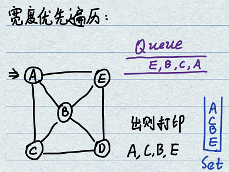
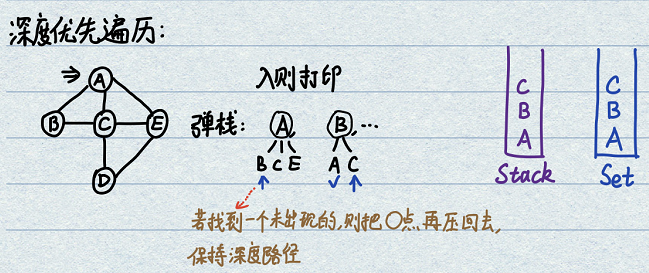
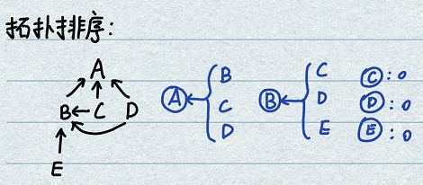
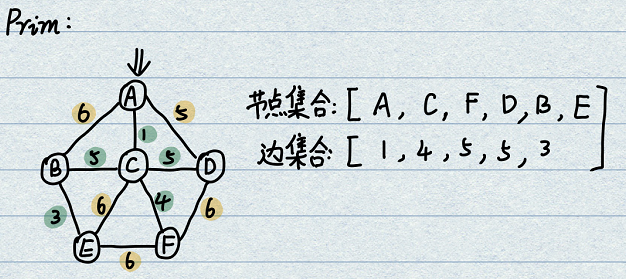
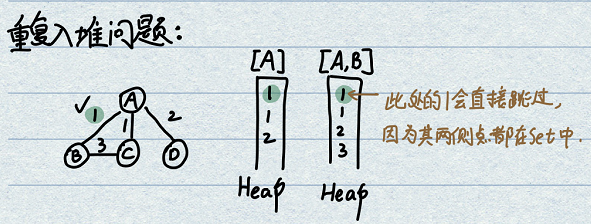
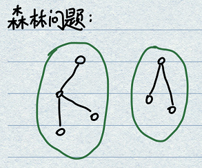

# 1.图的存储方式
图的算法相对简单，但是表达图的数据结构多种多样。可以将图表示为点集和边集。  
- **有向图与无向图**：有向图中的边是单向的，无向图也可以理解为特殊的有向图。  
- **邻接表**：构建一个表，表头为节点，表格内容为此节点的直接邻居。如果边有权重，则直接邻居节点可以用结构体存储。  
- **临接矩阵**：行为所有节点、列为所有节点，是一个正方形矩阵，对角线为0，没有直接相连的路为无穷。  

# 2.参考图结构(模板)
将图以最熟悉的结构进行表示和存储，支持所有的算法，能够方便地迁移到图相关的各类纷杂问题中。

```java
/* 图结构 */
public class Graph {
    public HashMap<Integer, Node> nodes; // key为编号，value为节点
    public HashSet<Edge> edges; // 边就是一个集合
    public Graph() {
        nodes = new HashMap<>();
        edges = new HashSet<>();
    }
}
/* 点结构 */
public class Node {
    public int value; // 数据项，点上的数值
    public int in; // 节点入度
    public int out; // 节点出度
    public ArrayList<Node> nexts; // 从此点出发，发散出去的边所连接的所有直接邻居
    public ArrayList<Edge> edges; // 属于此点的边，即所有从此点出发的有向边
    public Node(int value){
        this.value = value;
        in = 0;
        out = 0;
        nexts = new ArrayList<>();
        edges = new ArrayList<>();
    }
}
/* 边结构 */
public class Edge{
    public int weight; // 边的权重，一般指距离
    public Node from; // 从哪个点来
    public Node to; // 到哪个点去
    public Edge(int weight, Node from, Node to){
        this.weight = weight;
        this.from = from;
        this.to = to;
    }
}
```

# 3.图的宽度优先遍历(BFS)
二叉树是无环的，而图可能有环，因此要使用一种机制方式出现死循环情况发生。遵循宽度优先遍历使用queue的原则，再创建一个HashSet进行重复检测。  
- **流程**：
    - 从源节点开始一次按照宽度进队列，然后弹出；
    - 每弹出一个点，把该点所有没有进入过队列的点放入队列；
    - 直到队列变空。
- **注意**：对于某些相对简单的题目，例如城市只有1000个，可以使用一个数组完成寻址，相较于哈希表实现有更小的常数时间。
<div align=center>

</div>

```java
	public static void BFS(Node node){
		if(node == null) {return;}
	    Queue<Node> queue = new LinkedList<Node>();
	    HashSet<Node> set = new HashSet<Node>(); // 集合检测节点重复
	    /* 添加首个节点 */
	    queue.add(node);
	    set.add(node);
	    /* 处理队列，获取宽度遍历 */
	    while(!queue.isEmpty()){
	    	Node cur = queue.poll();
	    	System.out.println(cur.value); // 打印/处理节点
	    	for(Node next : cur.nexts) { // 考察所有邻接节点
	    		if(!set.contains(next)) { // 若没有见过则入队列、入集合
	    			queue.add(next);
	    			set.add(next);
	    		}
	    	}
	    }
	}
```

# 4.图的广度优先遍历(DFS)
广度/深度优先遍历用栈实现，先一条路走到死，再依次返回看哪条路可以继续走。同样需要用到一个集合记录是否重复。
- **流程**：
    - 1.将初始点放入Stack和HashSet，并且打印/处理（注意是在入栈的时候进行打印）；
    - 2.弹栈得到A节点，遍历A的nexts节点，只需要找到一个没有出现在HashSet中的节点B即可跳出遍历寻找（for的最后有个break）；
    - 3.如果找到了B，将原始节点A重新压入栈，之后将B入栈 & 打印/处理 & B在HashSet中注册；
    - 4.循环弹栈直到栈空。
- **分析**：
    - **重新入栈意义**：栈中永远保持的是深度的路径，因此需要在入栈时进行打印/处理。
    - **break意义**：for循环从cur节点的nexts中选出一个未注册过的节点进行分析，一旦找到一个就不再考察其他节点。即只逮住一条没走过的路走到黑，其他的路一律不管。
<div align=center>

</div>

```java
public static void DFS(Node node){
    if(node == null) {return;}
    Stack<Node> stack = new Stack<Node>();
    HashSet<Node> set = new HashSet<Node>(); // 集合检测节点重复
    /* 添加首个节点 */
    stack.add(node);
    set.add(node);
    System.out.println(node.value); // 入栈操作：打印/处理节点
    /* 处理栈，获取深度遍历 */
    while(!stack.isEmpty()){
        Node cur = stack.pop();
        for(Node next : cur.nexts) { // 考察所有邻接节点
            if(!set.contains(next)) { // 若没有见过则入队列、入集合
                stack.add(cur); // 弹栈节点重新入栈，保持深度序列
                stack.add(next);
                set.add(next);
                System.out.println(next.value); // 入栈操作：打印/处理节点
                break; // 只找一个邻接节点即可，一条路走到黑
            }
        }
    }
}
```

# 5.拓扑排序(Topology Sort)
是一种有向图的节点排序问题，需要找到一种排序方式使得所有的点都满足条件。最典型的场景是工程文件的编译顺序：先要找到最原始的文件进行编译，再逐步根据依赖关系进行逐步编译，直到所有文件编译完成。不能出现循环编译情况（有环）。
- **流程**：先查找入度为0的点A，将此点A和A点所有的影响都擦除。循环运行直到所有点遍历完。
<div align=center>

</div>

```java
public static List<Node> TopologySort(Graph graph) {
    /* 创建入度记录表，同时如果发现入度为0的节点入队列 */
    HashMap<Node, Integer> inMap = new HashMap<Node, Integer>(); // 记录节点入度表
    Queue<Node> queue = new LinkedList<Node>(); // 创建队列，维持整个动态消除过程
    for (Node node : graph.nodes.values()) { // 进行HashMap中的节点罗列
        inMap.put(node, node.in);
        if (node.in == 0) {
            queue.add(node);
        }
    }
    /* 开始动态消解节点和边 */
    List<Node> topologySort = new ArrayList<>();
    while (!queue.isEmpty()) {
        Node node = queue.poll(); // 入度为0的一个点出队列
        topologySort.add(node); // 添加到输出列表中
        // 更新所有节点的入度，发现等于0则入队列
        for (Node next : node.nexts) { // 分析出队列节点的nexts，即变动的节点
            inMap.put(next, inMap.get(next) - 1); // 擦除影响，入度-1，若等于0则添加到队列中
            if (inMap.get(next) == 0) {
                queue.add(next);
            }
        }
    }
    return topologySort;
```

# 6.最小生成树MST(Kruskal算法)
- **基本概念**：Minimum Spanning Tree。无向图中，在保证所有点的连通性前提下，使得所有边权重累加和最小的边集合。
- **Kruskal流程**：从边的角度考虑，对所有的边按照权重进行排序，逐个分析最小边。考察添加一个边是否会形成环。如果形成环则不添加，如果不形成环则添加，直到考察完所有边。具体流程：
    - 初始化：首先将所有的节点分立在独立的集合中，互相不连通。
    - 添加判断：考察即将添加的边edge时，其from和to节点如果不在同一个集合中，则不会形成环，可以添加；如果from和to在一个集合中，则形成了环。
    - 添加&合并：真正添加edge时，需要将from和to节点所在的两个集合进行合并。
- **成环分析**：整个流程的关键在于考察添加一个边时是否会形成环。可以通过并查集实现（具有集合查询和集合合并功能，而且能够在常数时间完成）。
```java
public static class EdgeSets {
    // 结构：节点为键，对应的值是所在的列表。
    public HashMap<Node, Set<Node>> sets = new HashMap<Node, Set<Node>>();

    public EdgeSets(Collection<Node> nodes) { // 构造函数，挨个添加所有节点
        for (Node node : nodes) {
            Set<Node> set = new HashSet<Node>();
            set.add(node);
            sets.put(node, set);
        }
    }
    /* 判断是否处于一个集合中 */
    public boolean sameSet(Node n1, Node n2) {
        return sets.get(n1) == sets.get(n2); // 地址相同则一致
    }
    /* 融合两个集合 */
    public void mergeSet(Node n1, Node n2) { // 融合两个集合
        Set<Node> n1Set = sets.get(n1); // 因为传递的是指针，所以可以这样操作
        Set<Node> n2Set = sets.get(n2);
        for (Node node : n2Set) { // 从n2的集合列表中搬运到n1的列表集合
            n1Set.add(node);
            sets.put(node, n1Set); // 修改每个n2集合节点的指向，改为和n1一致
        }
    }
}

public static Set<Edge> kruskalMST(Graph graph) {
    /* 构建小根堆 */
    PriorityQueue<Edge> heap = new PriorityQueue<>(new EdgeCpmparator());
    for (Edge edge : graph.edges) { // 将所有边入堆
        heap.add(edge);
    }
    /* 构建并查集 */
    EdgeSets unionFindSets = null;
    unionFindSets = new EdgeSets(graph.nodes.values());
    /* 构建结果容器 */
    Set<Edge> result = new HashSet<Edge>();
    /* 从小到大考察每一条边 */
    while (!heap.isEmpty()) {
        Edge edge = heap.poll();
        if (!unionFindSets.sameSet(edge.from, edge.to)) { // 不在同一个集合中，需要进行添加操作
            result.add(edge);
            unionFindSets.mergeSet(edge.from, edge.to); // 将两个集合融合在一起
        }
    }
    return result;
}
```


# 7.最小生成树MST(Prim算法)
- **Prim流程**：从节点的角度出发进行边寻找。通过不断解锁边、选中符合要求的边（被选中的边能够扩大节点集合范围）的方式逐步得到所有边。
    - 创建节点集合Set、解锁边集合Heap（PriorityQueue构成的小根堆）、结果集合EdgeSet；
    - 考察初始节点A，将A放入Set中，将A所有相邻边放入Heap中；
    - 从Heap中弹出最小边，判断此边的加入是否能够扩大Set：若不能则换边，若可以则将此边放入EdgeSet、新点B放入Set、所有新点B的边放入Heap；
    - 循环处理直至到Heap空。
<div align=center>

</div>

- **注意**：会出现一个边被反复放入Heap的问题，但是由于边出Heap筛选过程中有新节点增加检查机制，所以会直接跳过。
<div align=center>


</div>
<div align=center>

</div>

```java
/* 创建Edge比较器 */
public static class EdgeCpmparator implements Comparator<Edge>{
    @Override
    public int compare(Edge o1, Edge o2) {
        return o1.weight - o2.weight;
    }
}
/* Prim算法 */
public static HashSet<Edge> primMST(Graph graph){
    /* 容器创建 */
    HashSet<Node> set = new HashSet<>(); // 存放已涵盖节点
    PriorityQueue<Edge> heap = new PriorityQueue<>(new EdgeCpmparator()); // 存放解锁边，使用小根堆
    HashSet<Edge> edgeSetResult = new HashSet<>(); // 存放结果（最小生成树的边集合）
    
    for(Node node : graph.nodes.values()) { // 防止森林情况出现
        if(!set.contains(node)) { // 若还没考察过此节点，才进行边的寻找。配合上层for循环处理森林情况。
            /* 真正的搜索过程 */
            set.add(node); // 以随意一个节点为起点
            for(Edge edge : node.edges) { // 将此节点所有边放入堆
                heap.add(edge);
            }
            while(!heap.isEmpty()) { // 循环处理直到堆空
                Edge minEdge = heap.poll(); // 弹出最小边
                Node toNode = minEdge.to;
                if(!set.contains(toNode)) { // 不包含此新节点B，则需要添加B节点 & 保存此边 & 添加解锁边
                    set.add(toNode);
                    edgeSetResult.add(minEdge);
                    for(Edge edge : toNode.edges) {
                        heap.add(edge);
                    }
                }
            }
        }
    }
    return edgeSetResult;
}
```


01:59:16

# 题26:将图数据转化为图结构(接口函数)
- **题目**：N*3数组，第一列和第二列分别记录起始和结束城市编号，第三列记录有向距离，需要转化为模板结构。
```java
public static Graph createGraph(Integer[][] matrix){
    Graph graph = new Graph();
    for(int i = 0; i < matrix.length; i++){
        Integer from = matrix[i][0]; // 起始城市编号
        Integer to = matrix[i][1]; // 终止城市编号
        Integer weight = matrix[i][2]; // 有向边权重
        /* 检查from和to两个点是否在点集里面，若不在则添加 */
        if (!graph.nodes.containsKey(from)){
            graph.nodes.put(from, new Node(from));
        }
        if (!graph.nodes.containsKey(to)){
            graph.nodes.put(to, new Node(to));
        }
        /* 列举起始节点，创建边 */
        Node fromNode = graph.nodes.get(from);
        Node toNode = graph.nodes.get(to);
        Edge newEdge = new Edge(weight, fromNode, toNode); // 利用2个节点创建边
        /* 开始改动节点和边内部信息，添加关系 */
        fromNode.nexts.add(toNode);
        fromNode.edges.add(newEdge);
        fromNode.out++;
        toNode.in++;
        graph.edges.add(newEdge);
    }
    return graph;
}
```
