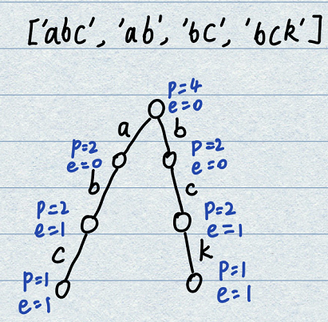
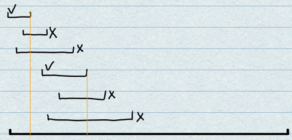
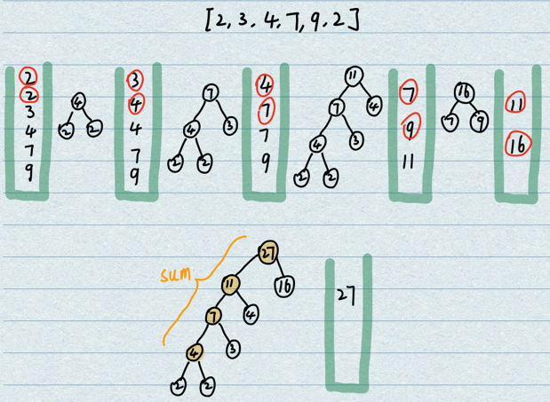
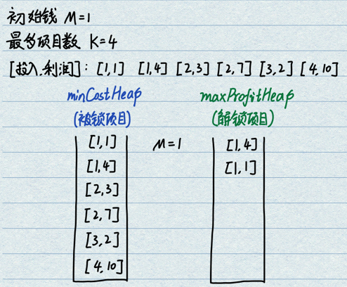
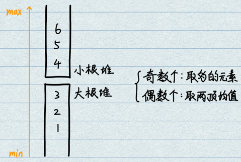

# 1.前缀树(Trie)
- **基本概念**：将一些分立的字符串挂在一棵树上，以此来便利地解决字符串出现次数、前缀个数等问题。
    - 经典的前缀树中，单个字符一定是固定在path上而不是在node上。
    - 每个节点的结构共由三部分构成：path、end、nexts列表，分别记录通过数量、结尾数量和指针列表。
    - 根节点的path值可以视为“以空字符串作为前缀的总个数”，即总共加入了多少个字符串。
    - 当每一个节点的路径非常多时，可以使用HashMap来替代全占位的数组，或使用TreeMap进行有序组织。

- **特点**：能够以字符串长度级别的复杂度完成`字符串查找`、`前缀检索`和`某字符串加入过几次`。哈希表可以实现第一个，但是无法实现后两个。

- **常用操作**：
    - **前缀数量查询**：索引到前缀位置，path数量即为前缀数量。
    - **字符串出现次数**：索引到字符串的位置，end数量即为出现次数。
    - **字符串删除**：首先判断是否存在此字符串，若存在则开始删除。每经过一个节点path--，到达最后一个节点时end--。需要考虑`特殊情况`，当某一个点的path值减到0时，需要将此节点和以后所有节点都进行释放。
<div align=center>

</div>

```java
public static class TrieNode {
    public int path;
    public int end;
    public TrieNode[] nexts; // HashMap<Char, TrieNode> nexts;

    public TrieNode() {
        path = 0;
        end = 0;
        // nexts[0] == null 没有走向'a'的路
        // nexts[1] != null 有走向'b'的路
        // ...
        // nexts[25] != null 有走向'z'的路
        nexts = new TrieNode[26];
    }
}
```

# 2.贪心算法
- **基本概念**：在某一个标准下，优先考虑最满足标准的样本，最后考虑最不满足标准的样本，最终得到一个答案的算法，叫做贪心算法。也就是说，不从整体最优上加以考虑，所做出来的是在某种意义上的局部最优解。本质上就是基于一个特定的标准依次考察每一个样本。
- **题目特征**：贪心策略的题目代码一般都非常的短（没有例外），只要确定好比较策略之后就可以写出代码。笔试中出现的概率不大，面试中几乎不会遇到。因为贪心策略题目无法考coding能力，单纯比较策略问题，属于0-1问题，不具有区分度。
- **解题套路**：
    - 1.实现不依靠贪心策略的解法X，可以使用暴力尝试；
    - 2.脑补出贪心策略A、贪心策略B、贪心策略C...（本质上就是设置不同的比较策略）；
    - 3.使用解法X和对数器，验证每一个贪心策略，使用实验的方式得知哪个贪心策略正确。
    - 4.从局部最优证明到整体最优一般非常麻烦，不需要过于纠结。
- **常用技巧**：
    - 根据某个标准建立一个比较器来`排序`；
    - 根据某个标准建立要给比较器来`组成堆`；

# 题27.字符串查询问题
- **题目**：一个字符串类型的数组arr1，另一个字符串类型的数组arr2。
    - arr2中有哪些字符，是arr1中出现的？请打印。
    - arr2中有哪些字符，是作为arr1中某个字符串前缀出现的？请打印。
    - 请打印arr2中出现次数最大的前缀。

```java
public static class Trie {
    private TrieNode root;

    public Trie() {
        root = new TrieNode();
    }

    /* 插入一个字符串 */
    public void insert(String word) {
        if (word == null) {
            return;
        }
        TrieNode cur = root; // 指向根节点
        root.path++; // 根节点首先加1
        int index = -1; // 存放26个字母索引值

        char[] chs = word.toCharArray();
        for (int i = 0; i < chs.length; i++) {
            index = chs[0] - 'a';
            if (cur.nexts[index] == null) { // 若不存在此节点，进行新建
                cur.nexts[index] = new TrieNode();
            }
            cur = cur.nexts[index]; // 指针下移，为后续处理做准备
            cur.path++; // 来到此点上，进行p自增
        }
        cur.end++; // 最后结束节点end自增
    }

    /* 删除某一个字符串 */
    public void delete(String word) {
        if (word == null || search(word) == 0) {
            return;
        }
        TrieNode cur = root; // 指向根节点
        cur.path--; // 在根节点处删除一个
        int index = -1; // 存放26个字母索引值
        char[] chs = word.toCharArray();
        for (int i = 0; i < chs.length; i++) {
            index = chs[0] - 'a';
            if (--cur.nexts[index].path == 0) { // 若有一个节点的path减到0，则直接置空
                cur.nexts[index] = null;
                // 如果是C++,需要手动遍历到底析构每一个节点
                return;
            }
            cur = cur.nexts[index];
        }
        cur.end--;
    }

    /* 查找一个字符串 */
    public int search(String word) {
        if (word == null) {
            return 0;
        }
        TrieNode cur = root; // 指向根节点
        int index = -1; // 存放26个字母索引值
        char[] chs = word.toCharArray();
        for (int i = 0; i < chs.length; i++) {
            index = chs[0] - 'a';
            if (cur.nexts[index] == null) { // 有ab但是查abc
                return 0;
            }
            cur = cur.nexts[index];
        }
        return cur.end;
    }

    /* 查找前缀字符串数量 */
    public int prefixNumber(String pre){
        if(pre == null) {
            return 0;
        }
        TrieNode cur = root; // 指向根节点
        int index = -1; // 存放26个字母索引值
        char[] chs = pre.toCharArray();
        for (int i = 0; i < chs.length; i++) {
            index = chs[0] - 'a';
            if (cur.nexts[index] == null) { // 如果树走完但是此字符串还没有遍历完，则无
                return 0;
            }
            cur = cur.nexts[index]; // 多少有点链表的感觉
        }
        return cur.path;
    }
}
```

# 题28.会议安排问题
- **题目**：一个项目要占用一个会议室宣讲，会议室不能同时容纳两个项目的宣讲。给定每一个项目的`[start, end]`时间，要求会议室进行的宣讲场次最多。返回最多的宣讲场次。
- **贪心策略1**：最早开始的会议先安排？若一个最早的会议贯穿了一天，则不能满足最多场次要求。反例能够否决。
- **贪心策略2**：持续时间越短先安排？若一个短会议同时压住了两个长会议，则不能满足最多场次要求。反例能够否决。
- **贪心策略3**：越早结束的会议先安排？可以达到最优解。
    - 先看哪个会议结束时间最早，先进行安排（A会议），将不能安排的会议删掉；
    - 时间边界右移到A会议的结束时刻；
    - 继续寻找剩余会议结束时间最早的会议。
<div align=center>

</div>

```java
public static class Metting{
    public int start;
    public int end;
    public Metting(int start, int end) {
        this.start = start;
        this.end = end;
    }
}

// 按照结束时间进行排序
public static class MettingComparator implements Comparator<Metting>{
    @Override
    public int compare(Metting o1, Metting o2) {
        return o1.end - o2.end;
    }
}

// 依次考察有序数组，进行会议安排
public static int bestArrange(Metting[] mettingList, int timePoint) {
    Arrays.sort(mettingList, new MettingComparator()); // 按照结束时间进行升序排列，依次考虑
    int cnt = 0;
    for(int i = 0; i < mettingList.length; i++) { // 依次考察每一个会议
        if(timePoint <= mettingList[i].start) { // 若time早于会议start，则安排此会议；若不早于则直接忽略。
            timePoint = mettingList[i].end;
            cnt++;
        }
    }
    return cnt;
}
```

# 题29.字符串拼接的最小字典序
- **题目**：将字符串列表中的所有字符串进行拼接，使得最终得到的大字符串具有最小的字典序。字典序：可以将单词想象为26进制的数字，如果两个字符串位数不同则少的单词需要补0。
- **贪心策略1**：将整个字符串列表按照字典序升序进行排列，再依次拼接？这样的策略不能实现最小的字典序，例如'b'和'ba'进行拼接，若按照字典序则是'bba'，大于'bab'。
- **贪心策略2**：只考虑两个字符串的拼接，a+b是否小于b+a，即a作为前缀是不是小于b作为前缀，若满足则把a放前面。总是按照拼接意义上的小字典序进行组织，最后得到的就是最优解。
```java
// 比较策略：如果o1在前的字典序比o1在后的字典序小，则o1在前。
public static class StringComparator implements Comparator<String>{
    @Override
    public int compare(String o1, String o2) {
        return (o1 + o2).compareTo(o2 + o1);
    }
}

public static String LowestLesicography(String[] strList) {
    Arrays.sort(strList, new StringComparator());
    String result = "";
    for(String cur : strList) { // 依次拼接字符串
        result += cur;
    }
    return result;
}

public static void main(String[] args) {
    String[] strs1 = { "jibw", "ji", "jp", "bw", "jibw" };
    System.out.println(LowestLesicography(strs1));

    String[] strs2 = { "ba", "b" };
    System.out.println(LowestLesicography(strs2));

}
```

# 题30.金条分割的最小代价(Huffman Coding)
- **题目**：需要将一根长度为60的金条划分为`[10,20,30]`的三根金条，每次分割都需要消耗分割前长度的成本，设计最节省的分割策略。
- **方案**：经典的霍夫曼编码问题，一种用于无损数据压缩的熵编码（权编码）算法，能够生成一颗最优二叉树。切割过程是从大到小，而考虑成本应当从小到大。使用堆的动态调整来实现一堆数字中最小值的获取。
    - 构建一个小根堆，将所有数字入堆；
    - 每次弹出两个值，进行加和，结果再次放入小根堆中；
    - 循环处理，直到堆中只剩一个数值，即为最后的花销。
<div align=center>

</div>

```java
public static int minCost(int[] lenList) {
    // 全部入小根堆
    PriorityQueue<Integer> heap = new PriorityQueue<>();
    for (int cur : lenList) {
        heap.add(cur);
    }
    int newLen = 0;
    int sum = 0; // 累加和
    // 动态处理，直到堆中只有一个数字
    while(heap.size() > 1) {
        newLen = heap.poll() + heap.poll(); // 每次弹出两个进行求和
        sum += newLen;
        heap.add(newLen); // 和的结果重新压入堆
    }
    return sum;
}
```

# 题31.项目利润与花费问题(大小根堆配合)
- **题目**：给定一些项目，每个项目有`成本`和`利润`。例如[3,1] [1,2] [4,3] [9,7] [9,4]。现给定初始资金M，最多能做的项目数K，且只能串行做项目。应当如何做项目保证结束时钱最多。
- **分析**：自然智慧下分析，早期资金较少因此只能挑选成本较低的项目，后期资金充足了才能去选择成本更高、收益更高的项目。
- **实现流程**：按照成本构建小根堆，放入所有项目，将此小根堆理解为`被锁住的项目`；按照利润构建大根堆，放入从小根堆中弹出的项目，将此大根堆理解为`解锁的项目`。
    - 先将所有的项目放入小根堆；
    - 按照现有资金将符合条件的项目放入大根堆（筛选能力所及的项目），弹出大根堆的堆顶，做完项目并获得利润；
    - 重复操作直至项目数满足/无项目可做。
<div align=center>

</div>

```java
public static class Node {
    public int c; // cost
    public int p; // profit
    public Node(int c, int p) {
        this.c = c;
        this.p = p;
    }
}
// 小根堆，按照cost组织。未解锁的项目
public static class minCostComparator implements Comparator<Node>{
    @Override
    public int compare(Node o1, Node o2) {
        return o1.c - o2.c;
    }
}
// 大根堆，按照profit组织。已解锁的项目
public static class maxProfitComparator implements Comparator<Node>{
    @Override
    public int compare(Node o1, Node o2) {
        return o2.p - o1.p;
    }
}

public static int maxMoney(int[] cList, int[] pList, int money, int k) {
    // 分别创建小根堆和大根堆
    PriorityQueue<Node> minCostHeap = new PriorityQueue<>(new minCostComparator());
    PriorityQueue<Node> maxProfitHeap = new PriorityQueue<>(new maxProfitComparator());
    // 依次输入所有节点，全部进入小根堆
    for (int i = 0; i < cList.length; i++) {
        minCostHeap.add(new Node(cList[i], pList[i]));
    }
    // 
    for (int i = 0; i < k; i++) {
        // 能力所及的项目，全部解锁
        while(!minCostHeap.isEmpty() && minCostHeap.peek().c <= money) { // 小根堆内有项目 && 小根堆堆顶可以做
            maxProfitHeap.add(minCostHeap.poll()); // 解锁所有符合的项目进入大根堆
        }
        if (maxProfitHeap.isEmpty()) { // 若都是未解锁项目，且k个项目没做完，出现了无项目可条，直接退出
            return money;
        }
        money += maxProfitHeap.poll().p; // 弹出大根堆堆顶，完成最赚钱的项目
    }
    return money;
}
```

# 题32.数据流的中位数(大小根堆配合，和贪心无关)
- **题目**：要求在一个数据流中随时获取中位数，每次新增一个数时调整快，而且给中位数也要快。
- **流程**：构建一个大根堆和一个小根堆。第一个数直接入大根堆。之后的数统一执行后续两个操作，保证最大的n/2在小根堆里，最小的n/2个数在大根堆里。
    - 1.判断x<=大根堆顶，如果满足则入大根堆；若不满足则入小根堆；
    - 2.判断大根堆和小根堆的尺寸，若size相差到达2，则进行平衡调整。
    - 若总数是偶数时取两堆顶平均；若总数是奇数则有唯一的中位数。
- **复杂度分析**：因为由两个堆构成，所以插入每个数的复杂度是$O(\log{N})$级别的。
<div align=center>

</div>

```java
// 小根堆比较器
public static class minComparator implements Comparator<Integer>{
    @Override
    public int compare(Integer o1, Integer o2) {
        return o1 - o2;
    }
}
// 大根堆比较器
public static class maxComparator implements Comparator<Integer>{
    @Override
    public int compare(Integer o1, Integer o2) {
        return o2 - o1;
    }
}

public static class MedianHolder{
    private PriorityQueue<Integer> minHeap = new PriorityQueue<>(new minComparator());
    private PriorityQueue<Integer> maxHeap = new PriorityQueue<>(new maxComparator());
    // 添加单个数字功能
    public void addNumber(int num) {
        if (maxHeap.isEmpty() || num <= maxHeap.peek()) { // 初始case 和 增加case
            maxHeap.add(num);
        } else {
            minHeap.add(num);
        }
        if (Math.abs(maxHeap.size() - minHeap.size()) > 1) { // 若相差大于1，进行平衡调整
            PriorityQueue<Integer> bigHeap = maxHeap.size() > minHeap.size() ? maxHeap : minHeap;
            PriorityQueue<Integer> smallHeap = maxHeap.size() <= minHeap.size() ? maxHeap : minHeap;
            smallHeap.add(bigHeap.poll());
        }
    }
    // 取出中位数
    public Integer getMiddle() {
        if ((maxHeap.size() + minHeap.size()) %2 == 0) { // 若是偶数则返回平均值
            return (maxHeap.peek() + minHeap.peek()) / 2;
        } else { // 若是奇数则返回多的数
            PriorityQueue<Integer> bigHeap = maxHeap.size() > minHeap.size() ? maxHeap : minHeap;
            return bigHeap.peek();
        }
    }
}
```
