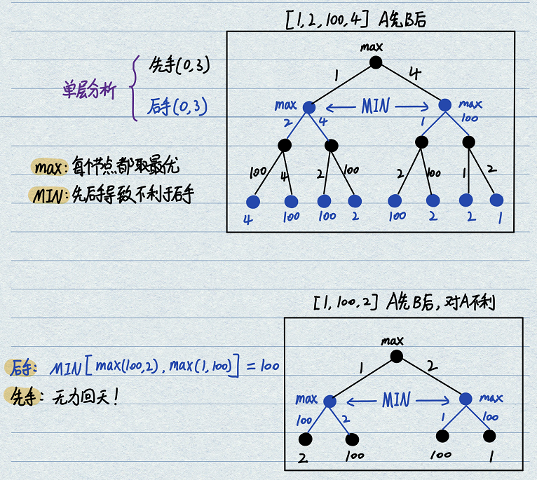
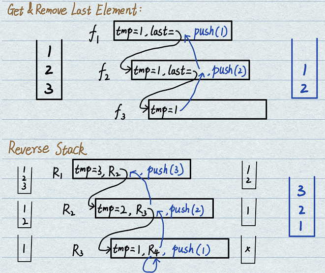

# 1.暴力递归
- **基本概念**：将问题进行彻底穷举，遍历所有可能得到最终结果。一定要学会如何尝试，这是动态规划的基础。
    - 分解：把问题转化为规模缩小了的`同类问题的子问题`；
    - 基元：有明确的不需要继续进行递归的条件(base case)；
    - 决策：有当得到了子问题的结果之后的决策过程(小问题结果经过处理得到大问题结果)；
    - 尝试：不记录每一个子问题的解，只关心尝试过程。
- **注意**：不要纠结于全局过程，只需要关注于局部过程，给每一个子过程都订同一标准，保证局部正确性。


# 题33.汉诺塔问题
- **题目**：打印n层汉诺塔从最左边移动到最右边的全部过程。整个过程只允许小圆盘压在大圆盘上。
- **分析**：初始n层全部在最左侧，如果将最大的圆盘移动到最右侧，则首先要将1~(n-1)层全部移动到中间，才可以将n移动到最右侧。整个过程中没有涉及到`决策过程`。
    - 创建一个搬运函数`P(i, from, to, other)`
    - 1)将1~(i-1)从from搬运到other，`P(i-1, from, other, to)`，是一个复杂递归操作；
    - 2)将i从from搬运到to，直接执行打印。是一个单步简单操作；
    - 3)将1~(i-1)从other搬运到to，`P(i-1, other, to, from)`，是一个复杂递归操作。

```java
public static void hanoi(int n) {
    if (n > 0) {
        process(n, "left", "right", "middle");
    }
}

public static void process(int n, String from, String to, String other) {
    if (n == 1) { // base case情况，只剩下n=1时，可以自由移动
        System.out.println("Move " + n + " from " + from + " to " + to);
    } else { // 正常情况，进行问题的拆解，得到子问题
        process(n - 1, from, other, to); // 将1~(n-1)从from移动到other
        System.out.println("Move " + n + " from " + from + " to " + to); // 将n从from移动到to
        process(n - 1, other, to, from); // 将1~(n-1)从other移动到to
    }
}

public static void main(String[] args) {
    int n = 3;
    hanoi(n);
}
```

# 题34.字符串子序列打印
- **题目**：打印一个字符串的全部子序列，包括空字符串。
- **分析**：在每一个字符位置，都有要和不要两个选择，形成一个满二叉树。(这种外部规定二叉树深度的结构，需要在递归内设置一个层数记录器控制basecase，类似于`微软折纸问题`。)
- **方法1**：累积方法，创建一个列表依次递增，到叶子节点时全部打印。

```java
/* 方法1：较费空间，使用累积方法 */
public static void process1(char[] arr, int i, List<Character> result) {
    if (i == arr.length) { // basecase, 到达二叉树叶节点
        printList(result);
        return;
    }
    /*支路：尝试添加此字符*/
    List<Character> resWithChar = copyList(result);
    resWithChar.add(arr[i]);
    process1(arr, i + 1, resWithChar);
    /*支路：尝试不添加此字符*/
    List<Character> resWithoutChar = copyList(result);
    process1(arr, i + 1, resWithoutChar);
}
```

- **方法2**：省空间做法，利用递归过程的压栈操作能够记录变量值的功能，直接对原数组arr进行改动操作。
```java
/* 方法2：节省空间，直接对arr数组操作 */
public static void process2(char[] arr, int i) {
    if (i == arr.length) { // basecase, 到达二叉树节点
        System.out.println(String.valueOf(arr));
        return;
    }
    char temp = arr[i]; // 首先保存此位置字符
    /*支路：尝试不添加此字符*/
    arr[i] = ' ';
    process2(arr, i+1);
    /*支路：尝试添加此字符*/
    arr[i] = temp;
    process2(arr, i+1);
}
```

- **总结**：
    - 这个程序还挺有意思，本质上就是在遍历一颗深度确定的二叉树，因此basecase一定是通过递归的层数控制。
    - 到达叶子节点时才打印最终结果，结果是单条路累积的结果。每到一层节点时，变量总是先压栈，处理更深层次的计算。
    - 递归树的总体高度就是字符串的长度。

# 题35.字符串全排列
- **题目**：打印一个字符串的全部排列，要求不能出现重复的排列。
- **分析**：考虑字符数组arr[0...n-1]，当考察i位置时，i位置之前所有元素构成确定字符串，i位置需要从str[i...n-1]中选取所有的元素交换并进行尝试。如果尝试到和i相同的值需要进行`分支限界`跳过。

```java
// 考察到i位置时，考虑arr[i...n-1]中所有元素落在i位置的所有可能
public static void process(char[] arr, int i, ArrayList<String> res) {
    if (i == arr.length) {
        System.out.println(String.valueOf(arr));
        res.add(String.valueOf(arr));
        return ;
    }
    boolean[] visit = new boolean[26]; // 分支限界表：单独考察i位置时，字母的选择记录表。只为i服务。
    for (int j = i; j < arr.length; j++) { // 第一个位置选择n次，依次递减
        if (!visit[arr[j] - 'a']) { // 分支限界条件：若j被选中过，直接跳过
            visit[arr[j] - 'a'] = true;
            swap(arr, i, j); // 进行交换，j位置生效
            process(arr, i + 1, res);
            swap(arr, i, j); // 交换回来，防止对下一轮的for产生影响
        }
    }
}

public static void main(String[] args) {
    String arr = "aabc";
    ArrayList<String> res = new ArrayList<>();
    process(arr.toCharArray(), 0, res);	
}
```

# 题36.纸牌博弈问题
- **题目**：给定整型数组，代表不同纸牌排成一条线。玩家A和B依次拿走每张纸牌，每次只能拿走最左侧或最右侧纸牌。规定A先于B。若A和B都绝顶聪明，返回最后获胜者的分数。
- **分析**：
    - 整体尝试策略：采用`从某一段范围L~R`上进行尝试的大方法；
    - **先手函数**：创建`int first(arr, L, R)`函数
        - basecase为L等于R，只能返回arr[L]；
        - 选择1：拿走L，则返回值应该为`arr[L] + second(arr, L+1, R)`，即在剩下的部分中后手；
        - 选择2：拿走R，则返回值应该为`arr[R] + second(arr, L, R-1)`，即在剩下的部分中后手；
        - 决策：取两个选择分支中的最大者，`max(option1, option2)`
    - **后手函数**：创建`int second(arr, L, R)`函数
        - basecase为L等于R，在此范围上是后手，因此已经被拿走，返回0；
        - 情况1：被先手拿走了L，只能在剩下范围内先手，`first(arr, L+1, R)`；
        - 情况2：被先手拿走了R，只能在剩下范围内先手，`first(arr, L, R-1)`；
        - 决策：两种情况中，先手一定会选择不利于自己的一个策略，因此要选`min(situation1, situation1)`
<div align=center>

</div>

- **原理分析**：
    - 暴力递归本质：对所有可能的情况进行枚举，本质上是使用分叉图的形式对未来可能情况进行列举；
    - f和s函数的理解：以顶层函数的max()调用为例，f(arr, 0, len-1)和s(arr, 0, len-1)其实是一组函数，两个函数分别表示A和B进行的两次决策。
    - f和s函数的两层依附关系：两个函数具有`更深层次的依附关系`。虽然f函数高于s函数，但是必须等s函数返回结果之后、f函数才能得到结果，因此`函数执行顺序`和`决策发生顺序`是颠倒的。从f的决策来看，f必须等待来自未来的/更加深层次的s给出结果，才能取max最大化自己的收益；从s的决策来看，虽然先一步于f运行，但是s选择必须是不利于自己的，只有这样才能使得f决策时利于f。而s函数内部又存在两个f函数，使得B在此时最大化自己的收益。
    - f和s函数关系总结：f最先决策，但是要等待未来的信息全了之后才能取max；s最先执行，但是决策时要选择不利于自己的返回。
    - f做为先手，其意志体现在两方面：一方面使得自己决策最大，一方面使得后手决策最小。

```java
public static int func(int[] arr) {
    if (arr == null || arr.length == 0) {
        return 0;
    }
    return Math.max( // AB两者之间取结果最大
            f(arr, 0, arr.length - 1), // A做为先手，在全范围上拿
            s(arr, 0, arr.length - 1) // B做为后手，在全范围上拿
    );
}

/* 前手函数：每个人的聪明都体现于此，都在自己的节点max */
public static int f(int[] arr, int L, int R) {
    if (L == R) { // 只剩1个元素，做为先手可以拿走
        return arr[L];
    }
    return Math.max( // 先手在最大化自己的收益
            arr[L] + s(arr, L + 1, R), // 先手取左
            arr[R] + s(arr, L, R - 1) // 先手取右
    );
}

/* 后手函数：min操作是上层f中max意志的体现，而内部f则是在max自己节点 */
public static int s(int[] arr, int L, int R) {
    if (L == R) { // 只剩1个元素，且自己是后手，则说明已经结束
        return 0;
    }
    return Math.min( // 先手会把最差情况给后手
            f(arr, L + 1, R), // 先手取左，考察剩下范围
            f(arr, L, R - 1) // 先手取右，考察剩下范围
    );
}
```

- **注意**：之前所有的尝试方法都是`从左到右通过i索引`依次尝试，而现在是`从某一段范围L~R中`进行尝试。

# 题37.基于递归的栈逆序
- **题目**：给定一个栈，请逆序此栈，不能申请额外的数据结构，只能使用递归函数。
- **分析**：采用两步的方法，分别实现两个递归：
    - 函数1：一个能够完成`栈的釜底抽薪功能`的函数f，即只取出栈底元素，其他元素顺序保持不变；
    - 函数2：通过f函数，递归地实现每个栈底元素的出栈，再通过逐个入栈完成逆序。
<div align=center>

</div>

```java
public static void reverseStack(Stack<Integer> stack) {
    if (stack.isEmpty()) { // basecase，栈空返回
        return;
    } else {
        int tmp = getAndRemoveLastElement(stack); // 获取底端元素
        reverseStack(stack); // 递归调用，形成系统栈结构
        stack.push(tmp); // 递归结束依次压栈，获得逆序
    }
}

/* 功能：只取出栈底元素，其他元素顺序保持不变 */
public static int getAndRemoveLastElement(Stack<Integer> stack) {
    int tmp = stack.pop();  // 先保存此时栈顶元素
    if (stack.isEmpty()) { // basecase，若发现空栈，返回last节点
        return tmp;
    } else {
        int last = getAndRemoveLastElement(stack);
        stack.push(tmp); // tmp值重新入栈，此时顺序是逆序的
        return last; // 栈底元素的直通通道，最终返回此值
    }
}
```

# 题38.数字转字符串
- **题目**：规定1对应A、2对应B、3对应C...。给定一个数字字符串例如"111"，可以转化为"AAA"，"KA"和"AK"。给定一个只有数字字符构成的字符串str，返回有多少种转化结果。
- **分析**：假设来到了i位置，若0~i-1位置都已经转换完成，则应考虑i位置所有的可能性：
    - 若i==len，说明已经完成转化，结果数量+1；
    - 若[i]==0，说明之前的排列导致i位置失效，结果数量不增；
    - 若[i]==1，则有两种情况，一种是i单独成字符，一种是i和i+1一起成字符；
    - 若[i]==2，则有两种情况，一种是i单独成字符，一种是在i+1位于{0~6}中时，i和i+1一起成字符；
    - 若[i]=={3~9}，则i只能单独成字符。
- **总结**：这种从左往右的试法是非常常见的。

```java
/* 来到i位置，(0~i-1)位置已经确定，求i位置的可能数量 */
public static int process(char[] arr, int i) {
    if (i == arr.length) { // 来到终止位置，生成一条记录
        return 1;
    } else if (arr[i] == '0') { // 否定之前的决定
        return 0;
    } else if (arr[i] == '1') { // 压中了数字1，考虑两种情况的数量求和
        int num = process(arr, i + 1); // i独立，后续有多少种数量
        if (i + 1 < arr.length) { // 如果还有i+1元素，考虑组合
            num += process(arr, i + 2); // i和i+1两者合在一起，后续有多少种数量
        }
        return num;
    } else if (arr[i] == '2') { // 压中了数字2，考虑两种情况的数量求和
        int num = process(arr, i + 1); // i独立，后续有多少种数量
        // 筛选可以混合的条件，第二位要位于0-6之间
        if (i + 1 < arr.length && arr[i + 1] >= '0' && arr[i + 1] <= '6') {
            num += process(arr, i + 2);
        }
        return num;
    }
    // arr[i] == '3'~'9'，只有一种转化情况
    return process(arr, i + 1);
}
```

# 题39.背包问题
- **题目**：给定两个长度都为N的数组weights和values，索引i分别表示i号物品的重量和价值。给定正数bag表示最大容纳重量。返回能够装下的最大价值。
- **分析**：依然是从左往右的尝试策略，从0开始每个货物都尝试要和不要两个选择，本质上依然是一颗二叉树的决策和遍历。
- **方法比较**：递归原则，找可变参数形式最简单(最好是变量，不要是链表)、数量最少的方法。这是后面改动态规划的基本。

```java
/* 方法1：单次考察法 */
public static int process(int[] w, int[] v, int bag, int i, int allWeight){ // 函数返回的是取到的value
    if (allWeight > bag){ // basecase:若现在重量超标，以后的都无法获取，价值增长为0
        return 0;
    }
    if (i == w.length){ // 已经无元素可分析，价值增长为0
        return 0;
    }
    int take = v[i] + process(w, v, bag, i + 1, allWeight + w[i]); // 拿:累加当前v和重量，继续考察下i+1元素
    int notTake = process(w, v, bag, i + 1, allWeight); // 不拿：忽略当前v和重量，考察i+1元素
    return Math.max(take, notTake);
}

/* 方法2：累计结果法 */
public static int process(int[] w, int[] v, int bag, int i, int allWeight, int allValue){
    if (allWeight > bag){
        return allValue;
    }
    if (i == w.length){
        return allValue;
    }
    // 采用累加形式，到basecase才返回最终结果
    int take = process(w, v, bag, i + 1, allWeight + w[i], allValue + v[i]);
    int notTake = process(w, v, bag, i + 1, allWeight, allValue);
    return Math.max(take, notTake);
}
```

# 题40.N皇后问题
- **题目**：指在N*N的棋盘上要拜访N个皇后，要求任意两个皇后不同行、不同列，也不在同一条斜线上。给定一个整数n，返回n皇后的摆法有多少种。
- **题目背景**：N皇后问题是用于大规模集群性能测试的标杆题目。
- **分析**：每一行放一个皇后，这样可以使得N个皇后自然地满足不同行要求。放置时只需要考虑当前皇后不和之前的同列、同斜线即可。
- **方法1**：基于判断逻辑，在每一行开展for考察，只有复合的位置才进行尝试和累计。
```java
public static int queen(int n){
    if (n < 1){
        return 0;
    }
    int[] record = new int[n]; // 第i行的皇后，放置在了record[i]列
    return process(record, n, 0);
}

public static int process(int[] record, int n, int i){ // 递归函数返回的是整型，因此是累加形式的递归
    if (i == n){ // 来到最后一个位置，表明之前的序列可以形成一个有效组合
        return 1;
    }
    int num = 0;
    for (int j = 0; j < n; j++){ // 遍历n个列，探测是否位置合规，合规则分析，不合规则跳过
        if (valid(record, i, j)){
            record[i] = j; // 点上第i行的皇后（此条会在每一个复合条件的循环中被多次覆盖执行）
            num += process(record, n, i+1); // 加上i+1行上的尝试数量
        }
    }
    return num;
}

public static boolean valid(int[] record, int i, int j){
    // 考察(i,j)位置上的皇后放置是否合理
    for (int k = 0; k < i; k++){ // k只需要遍历到i位置即可，无需全部遍历
        if (record[k] == j || Math.abs(k-i) == Math.abs(record[k]-j)){ // (k,record[k])(i,j)两个点处于同一列或共斜线
            return false;
        }
    }
    return true;
} 
```

- **方法2**：基于位运算完成加速，本质上是使用位运算完成无效位的标记。让每一行做的选择都变成限制信息。
```java

```
