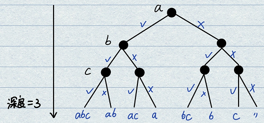

# 1.哈希函数
- **基本概念**：把任意长度的输入（又叫做预映射pre-image）通过散列算法变换成固定长度的输出，该输出就是散列值。具备四个特性：
    - 输入域无穷，输出域有限；
    - 相同输入一定返回相同输出值，即没有任何随机成分；
    - 可能会发生哈希碰撞，但是可能性非常小；
    - 均匀性：能够将输入均匀地离散在输出域（即使输入有规律，输出也会没有规律，彻底离散掉）。
- **哈希函数举例**：
    - **MD5算法**返回范围为0~2^64-1，是一个16位的16进制数；
    - **SHA1算法**返回范围为0~2^128-1，是一个32位的16进制数；

- **基本用法**：通过f函数之后之后在S域上均匀分布，再通过%M在0~M上均匀分布。利用此均匀分布性质可以解决很多大数据相关的题目。

# 2.哈希表
- **具体实现**：不断加入键值对，哈希函数的性质能够保证每一个位置的链表长度保持均匀。
    - 增加：
    - 扩容：
    - 

哈希表在使用的时候，增删改查可以做到O(1)，不是理论上的。

- **扩容分析**：分析log(N)
    - 技术1：通过链长度定较大来将O(log(N))逼近O(1)
    - 技术2：java等虚拟机技术能够做到，通过离线扩容技术不占用用户的时间。
    - 技术3：将单链表替换为一个有序树，提高搜索效率。
    - 技术4：基于开放地址法，本质上是通过数组进行索引，占满之后指向下一片存储区域。

# 3.布隆过滤器
- **基本概念**：在黑名单问题、爬虫去重问题中，一种集合结构只有`add`和`check`，没有`delete`，极大地降低存储空间使用，但是允许有一定程度的失误率（会误杀但不会漏放）。布隆过滤器的失误率不可避免，但是可以设置的非常低。

- **场景举例1**：设有100亿个URL黑名单不允许用户访问，每个URL最长64 Byte。用户使用时给出一个URL进行黑名单检索判别。不需要支持删除功能。若使用基于哈希表HashSet的方法，共需要6400亿Byte = 640 GB进行存储，代价太大；

- **场景举例2**：使用爬虫开启多线程爬取信息时，不希望出现两个线程爬取同一个网站的情况。因此需要准备黑名单将所有已经爬过的网站进行记录。爬取过程之前首先检查是否出现重复情况。

- **具体实现**：本质上就是在借助哈希函数和位图采集黑名单URL的指纹。
    - 1.构建一个长度为M的位图，占用空间为M/8个字节；
    - 2.选取K个哈希函数，将URL依次通过哈希函数f_k获得out_k，对out_k取模M得到m_k，在位图的对应位上置1描黑。
    - 3.循环处理完100亿个URL，获得了一个布隆过滤器版本的黑名单集合。
    - 查询：一个新的URL经过K个哈希函数，取模M之后获得K个位置。若K个位置全是1，则认为此URL位于黑名单内；若至少有一个位置为0，则不在黑名单内。

- **失误率定性分析**：位图长度M很大程度上影响着系统的失误率P，若位图长度M较小则导致失误率很高，增加M长度会发生边际递减效应；哈希函数的数量也会影响系统失误率，P会先随着K的增加而减小，后随着K的增加而升高（因为过高的K会耗尽位图长度M）。

- **失误率定量分析**：给定样本量n=100亿和失误率P=0.0001，需要确定位图长度M和哈希函数数量K：
    - **确定位图的M位**：根据下式计算，结果向上取整，位数除以8得到比特长度，约为26G，相较于原始的640G急剧减少。
    $$ M = - \frac{n*ln{p}}{(ln{2})^2} $$
    - **确定哈希函数个数K**：根据下式计算，之后向上取整得到哈希函数个数。
    $$ K = ln{2}*\frac{m}{n} $$
    - **扩大M后获取真实P**：根据以下公式进行计算。
    $$ P = \left ( 1- e^{-\frac{n*K}{M}} \right ) ^ K $$
    - **最终结果**：将位图大小从26G调整到28G，哈希函数数量定为13，真实失误率约为6/100,000。

# 题41.大数据量频次统计
- **题目**：设有一个大文件有40亿个无符号整数（0~2^32-1, 约到42亿）。如果只给定1G内存，返回出现次数最多的数字。
- **经典解法分析**：使用哈希表进行统计，key表示数字，value表示频率。在最坏情况下所有数都不同，需要存储40亿个2*4 Byte = 320亿 Byte，即32G空间。内存无法承受。
- **进阶方法分析**：将每一个数通过Hash函数映射得到哈希值，再对每个哈希值取模100，映射到0~99空间内。通过此均匀映射把40亿个数分配到0~99号个小文件内。再在每个小文件内使用哈希表统计，每个哈希表最大尺寸为0.32G，可以顺序地容纳。
    - 在数字都不同情况下，哈希函数一定能够完成整体的均分；  
    - 相同的数字一定会被分配到同一个文件中；  
    - 即使出现了取模碰撞也没有关系，哈希表能够在小文件内进行统计。

# 题42.设计RandomPool结构

# 题43.Bit Map实现

将int数组拼成一个bit数组。
    - 构造：
    - 索引：
    - 位置1：
    - 位置0：

