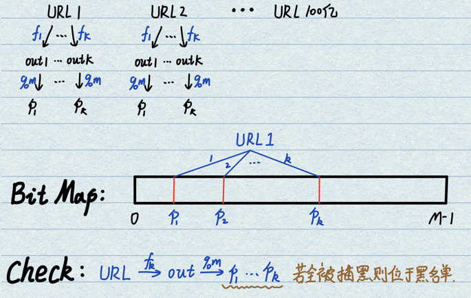

# 1.哈希函数
- **基本概念**：把任意长度的输入（又叫做预映射pre-image）通过散列算法变换成固定长度的输出，该输出就是散列值。具备四个特性：
    - 输入域无穷，输出域有限；
    - 相同输入一定返回相同输出值，即没有任何随机成分；
    - 可能会发生哈希碰撞，但是可能性非常小；
    - 均匀性：能够将输入均匀地离散在输出域（即使输入有规律，输出也会没有规律，彻底离散掉）。
- **哈希函数举例**：
    - **MD5算法**返回范围为0~2^64-1，是一个16位的16进制数；
    - **SHA1算法**返回范围为0~2^128-1，是一个32位的16进制数；

- **基本用法**：通过f函数之后之后在S域上均匀分布，再通过%M在0~M上均匀分布。利用此均匀分布性质可以解决很多大数据相关的题目。

# 2.哈希表
- **具体实现**：创建一个特定长度M的空间，每个空间指向一个单链表。
    - **增加**：key通过哈希函数f和取模M运算得到位置序号，将此key-value对后缀在对应位置的链表上。哈希函数的性质能够保证M条链均匀边长。
    - **查找**：将查找key通过哈希函数f和取模M运算得到位置序号，去指定的链表上进行寻找。
    - **扩容**：当链长超过了一个阈值，对空间M进行两倍扩容，所有key重新通过哈希函数f和取模2M挂到新表中，能够使得平均链长减半。
<div align=center>

</div>

- **扩容代价分析**：若加入N个key，则最差情况下发生log N次扩容，每次扩容复杂度为O(N)。当到N时总代价为O(N\*logN)，平均单次新增代价为O(logN)。
    - **技术1**：通过链长度定较大来将O(log(N))逼近O(1)
    - **技术2**：java等虚拟机技术能够做到，通过离线扩容技术不占用用户的时间。
    - **技术3**：将单链表替换为一个有序树，提高搜索效率。(java采用此种改进方法，C++没有)
    - **技术4**：基于开放地址法，本质上是通过数组进行索引，占满之后指向下一片存储区域。

- **总代价分析**：因为很多优化方法的存在，哈希表在`使用`时增删改查操作可以做到O(1)，而真实理论值应为O(logN)。

# 3.布隆过滤器(Bloom Filter)
- **基本概念**：应用在黑名单问题、爬虫去重问题中。一种集合结构只有`add`和`check`操作，没有`delete`操作。能够以一定程度的失误率（会误杀但不会漏放）极大地降低存储空间与查找时间的结构。布隆过滤器的失误率不可避免，但是可以设置的非常低。

- **场景举例1**：设有100亿个URL黑名单不允许用户访问，每个URL最长64 Byte。用户使用时给出一个URL进行黑名单检索判别。不需要支持删除功能。若使用基于哈希表HashSet的方法，共需要6400亿Byte = 640 GB进行存储，代价太大；

- **场景举例2**：使用爬虫开启多线程爬取信息时，不希望出现两个线程爬取同一个网站的情况。因此需要准备黑名单将所有已经爬过的网站进行记录。爬取过程之前首先检查是否出现重复情况。

- **具体实现**：本质上就是在借助Hash函数和Bit Map采集黑名单URL的指纹信息。
    - 1.构建一个长度为M的位图，若使用int数组构建则位图占用空间为M/8字节；
    - 2.选取K个哈希函数，将URL依次通过哈希函数f_k获得out_k，对out_k取模M得到m_k，在位图的对应位上置1描黑。
    - 3.循环处理完100亿个URL，获得了一个布隆过滤器版本的黑名单集合。
    - 查询：一个新的URL经过K个哈希函数映射，取模M之后获得K个Bit Map上的位置。若K个位置全是1，则认为此URL位于黑名单内；若至少有一个位置为0，则不在黑名单内。
<div align=center>

</div>

- **失误率定性分析**：位图长度M很大程度上影响着系统的失误率P，若位图长度M较小则导致失误率很高，增加M长度会发生边际递减效应；哈希函数的数量也会影响系统失误率，P会先随着K的增加而减小，后随着K的增加而升高（因为过高的K会耗尽位图长度M）。
<div align=center>

</div>

- **失误率定量分析**：给定样本量n=100亿和失误率P=0.0001，需要确定位图长度M和哈希函数数量K：
    - **确定位图的M位**：根据下式计算，结果向上取整，位数除以8得到比特长度，约为26G，相较于原始的640G急剧减少。
    $$ M = - \frac{n*ln{p}}{(ln{2})^2} $$
    - **确定哈希函数个数K**：根据下式计算，之后向上取整得到哈希函数个数。
    $$ K = ln{2}*\frac{m}{n} $$
    - **扩大M后获取真实P**：根据以下公式进行计算。
    $$ P = \left ( 1- e^{-\frac{n*K}{M}} \right ) ^ K $$
    - **最终结果**：将位图大小从26G调整到28G，哈希函数数量定为13，真实失误率约为6/100,000。

# 4.一致性哈希原理(Consistent Hashing)
一致性哈希算法在1997年由麻省理工学院的Karger提出，目的是解决分布式缓存的问题。在移除或者添加一个服务器时，能够尽可能小地改变已存在的服务请求与处理请求服务器之间的映射关系。一致性哈希解决了简单哈希算法在分布式哈希表( Distributed Hash Table，DHT) 中存在的动态伸缩等问题。主要讨论数据服务器是如何进行组织。现今各大公司实现的底层分布式数据库全是基于一致性哈希原理，这被誉为谷歌改变世界的三大技术之一。 
> Karger D, Lehman E, Leighton T, et al. Consistent Hashing and Random Trees: Distributed Caching Protocols for Relieving Hot Spots on the World Wide Web.[C]// Twenty-ninth Acm Symposium on Theory of Computing. 1997.

- **服务器的分类**：
    - `逻辑端`任何实例都是等效的，维护公有数据，可以轻松拓展；
    - `数据端`有单台服务器和分布式服务器的区别。当查询数据时会通过逻辑端完成数据端的数据查询，若是单台服务器（例如MySQL）可以直接得到结果；若是分布式服务器则需要逻辑端完成数据的归属计算，再去指定服务器上读取数据。

- **经典分布式组织方法（哈希值取模）**：逻辑端通过查询数据的哈希函数映射和取模运算获取数据归属，再去指定服务器读取数据。此结构可以使得高频词、中频词和低频词均匀地分配在多台服务器上，实现负载均衡。
    - 注意：数据查询的Hash Key的选择一定要使用种类比较多、使得高中低频次种类都保证一定数量。例如身份证号、姓名就是合适的，国家名、男女都是不合适的。
    - 缺点：经典哈希取模方案组织的分布式结构不能妥善地处理`数据端新增`的情况，如果服务器数量从3增加到4，所有数据都需要进行重新求哈希取模4，数据迁移是全量的。
<div align=center>

</div>

- **一致性哈希**：不使用模运算，将哈希的输出域想象成一个环，在环内进行节点分配。逻辑端的每台服务器内部都有序存储着计算节点的哈希值，在检索时进行二分查找锁定服务器的位置。这样的组织形式会有两个问题：
    - **问题1**：节点数量较少时无法均分整个环；
    - **问题2**：即使节点能够均分，新增机器时也会导致不均分；
    - **虚拟节点技术**：可以同时解决上面的两个问题。使用按比例抢环的方法，处理初始不均衡和增减机器不均衡共两个问题。同时还能根据机器的实际状况实现负载管理功能。虚拟节点技术可以轻松地实现以下四个功能：
        - 1.数据迁移：在底层写一个简单的对应关系即可完成；
        - 2.增机器：当新增m4节点时，m4从[m1,m2,m3]中获取几乎等量的数据；
        - 3.减机器：当删除m4节点时，m4向[m1,m2,m3]发送几乎等量的数据；
        - 4.管理负载：通过实际机器的状况和计算能力进行虚拟节点数量的控制，从而实现负载的均衡；
<div align=center>

</div>
<div align=center>

</div>

# 题41.大数据量频次统计
- **题目**：设有一个大文件有40亿个无符号整数（0~2^32-1, 约到42亿）。如果只给定1G内存，返回出现次数最多的数字。
- **经典解法分析**：使用哈希表进行统计，key表示数字，value表示频率。在最坏情况下所有数都不同，需要存储40亿个2*4 Byte = 320亿 Byte，即32G空间。内存无法承受。
- **进阶方法分析**：将每一个数通过Hash函数映射得到哈希值，再对每个哈希值取模100，映射到0~99空间内。通过此均匀映射把40亿个数分配到0~99号个小文件内。再在每个小文件内使用哈希表统计，每个哈希表最大尺寸为0.32G，可以顺序地容纳。
    - 在数字都不同情况下，哈希函数一定能够完成所有数字总数的均分；  
    - 相同的数字一定会被分配到同一个文件中；  
    - 即使出现了取模碰撞也没有关系，哈希表能够在小文件内进行统计。
<div align=center>

</div>

# 题42.设计RandomPool结构
- **题目**：设计一种结构，具有以下三个功能。
    - insert(key): 将某个key加入到该结构，做到不重复加入；
    - delete(key): 将原本在结构中的某个key移除；
    - getRandom(): 等概率随机返回结构中的任何一个key；
    - 要求：insert、delete和getRandom方法的时间复杂度都是O(1)。


# 题43.Bit Map实现
- **题目**：使用int数组拼出比特数组，并且进行单比特赋值操作。
<div align=center>

</div>

```java
public static void main(String[] args){
    int a = 0; // a == 4Byte == 32 bits
    int[] arr = new int[10]; // 32 bits * 10 -> 320 bits

    // arr[0] int  0~31
    // arr[1] int 32~63
    // arr[2] int 64~95

    // 索引某位
    int i = 178;
    int numIndex = i / 32; // 定位到此bit在哪个数上面
    int bitIndex = i % 32; // 定位到此bit在此数的哪个bit上面

    // 取某位状态
    int s = (arr[numIndex] >> (bitIndex)) & 1 // 此数先进行右移，将目标位放置在最右侧，再和1进行与运算即可得到此位
    s = (arr[i / 32] >> (i % 32)) & 1

    // 将某位状态置1
    arr[numIndex] = arr[numIndex] | (1 << (bitIndex)) // 先制造一个特定位为1的数，再和对应的数相或

    // 将某位状态置0
    arr[numIndex] = arr[numIndex] & (~(1 << (bitIndex))) // 先制造一个特定位为0、其余全为1的数，再和对应的数相与

}
```
