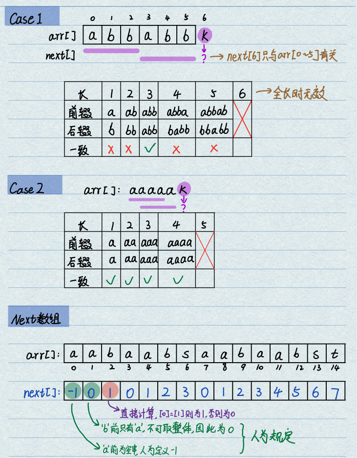
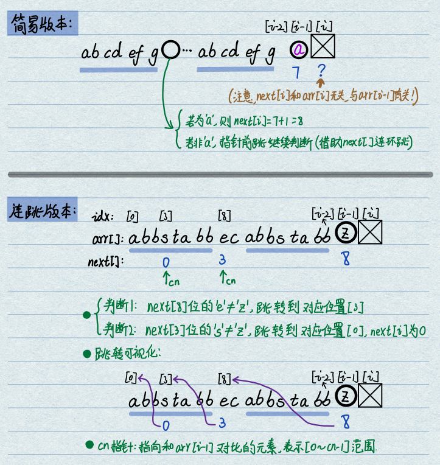
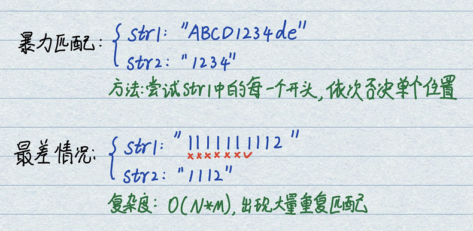
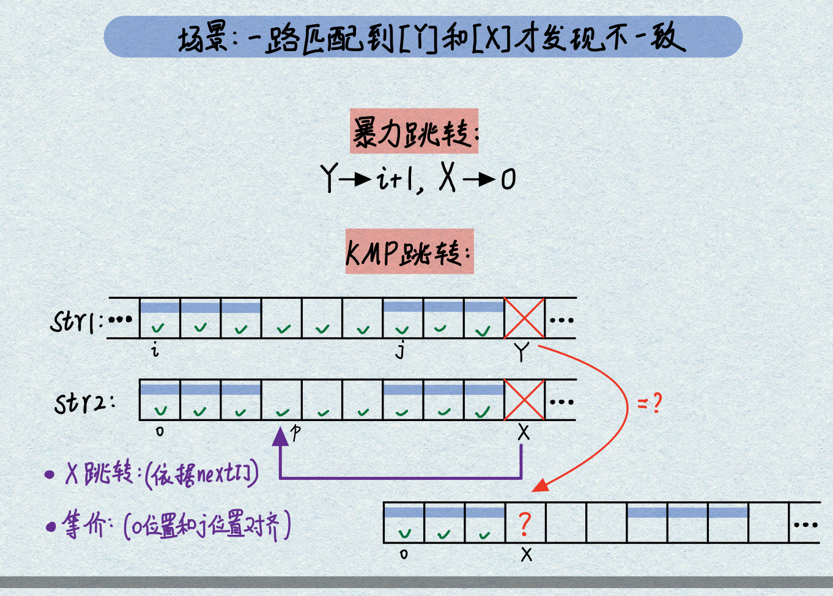
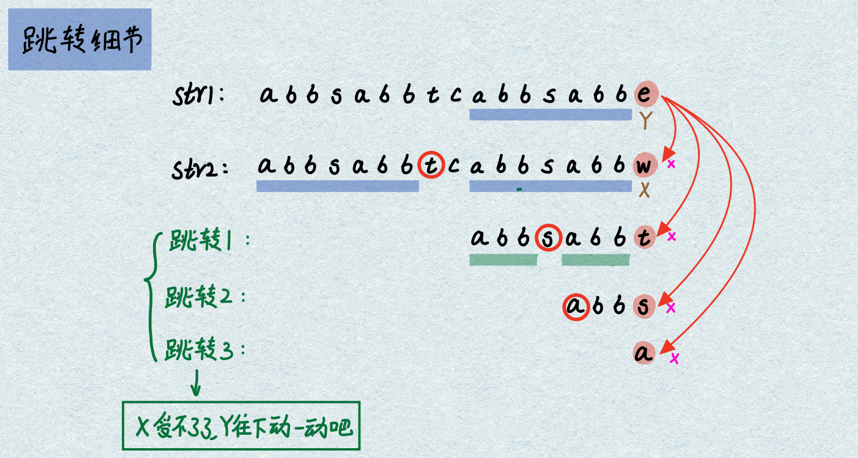
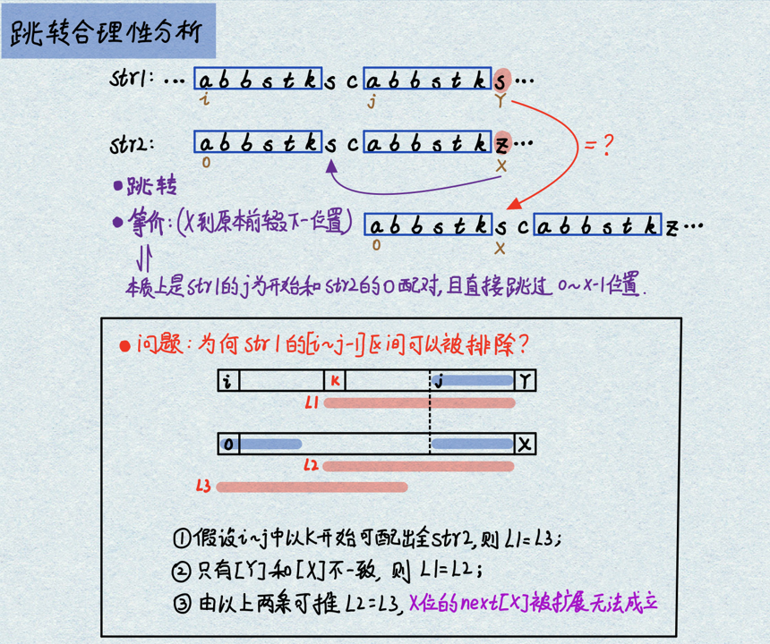
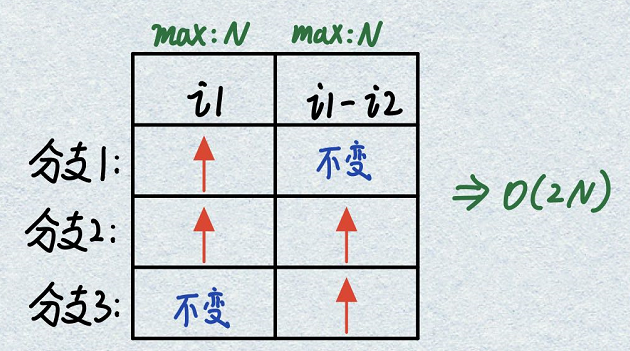

# 1.最长[前缀后缀相等]子序列长度数组next[]
- **基本概念**：针对KMP算法中短字符串str2(arr)生成的特定数组。数组中i位置的数值next[i]只和arr[0\~i-1]元素有关，和arr[i]无关。获取最长的子序列长度，使得前缀与后缀相等。
<div align=center>

</div>

- **next[]数组计算**   
在具体计算时，next\[0\]=-1和next\[1\]=0都是固定值；next\[2\]位置通过前两个元素是否相等进行计算；next\[3\]及以后所有元素均可以通过前向查询进行计算（类似于递归）。
    - 1.假设来到了i位置，需要计算next\[i\]的数值。
    - 2.现在已经有了next\[i-1\]的数值，表示从0到i-2位置上的最长子序列长度。
    - 3.根据cn位置的数值和arr[i-1]的数值相等情况进行分支判断。
<div align=center>

</div>

```java
static int[] getNextArr(char[] arr){
    /* ==========数组构建与初始化========== */
    if (arr.length == 1){
        return new int [] {-1};
    }
    int[] next = new int[arr.length];
    next[0] = -1; // 人为定义-1
    next[1] = 0;  // 认为定义0
    /* =============变量设计============= */
    int i = 2;   // 若长度大于2，从next[2]开始计算
    int cn = 0;  // 最巧妙的变量，指向和arr[i-1]对比的元素，也表示重复范围为[0~cn-1]
    /* ===========循环求next[]=========== */
    while (i < arr.length){
        if (arr[i-1] == arr[cn]){   //==>[情况1]找到了匹配长度，可以计算next[i]数值，并开启新一轮计算
            next[i] = cn + 1; // (1)将正确数值放入next[i]
            cn++;             // (2)cn此时存储next[i]的值，为i+1元素计算做准备
            i++;              // (3)next[i]完成计算，自增计算i+1位置
            /* 单行运行简化：next[i++] = cn++; */
        } else if (cn > 0){         //==>[情况2]若不相等，且能继续使用next往前跳转。此情况只修改cn，不修改i。
            cn = next[cn];
        } else {                    //==>[情况3]此时cn=0，无法找到任何重复前缀后缀长度，next[i]置0，cn已经自动清零。继续考察i+1。
            next[i++] = 0;
        }
    }
    return next;
}
```

# 2.KMP算法
- **基本概念**：KMP算法是一种改进的字符串匹配算法，由D.E.Knuth，J.H.Morris和V.R.Pratt提出，是一种在Brute-Force算法（最差情况下复杂度O(N*M)）的基础上提出的模式匹配算法。其核心是利用匹配失败后的信息，尽量减少模式串与主串的匹配次数以达到快速匹配的目的。KMP算法的输出为：
    - 若str1中存在str2，返回str1中的起始位置；
    - 若str1中不存在str2，返回-1。
<div align=center>

</div>

- **KMP算法流程**：KMP只是在暴力匹配的基础上进行了加速。通过next数组的构建，利用str2字符串内部的**前后缀相等部分**进行跳跃加速。
    - str1以i为开头开始匹配，直到str1[Y]位置才与str2[X]不一致；
    - next[X]的值指向了最长前缀的下一个位置p；
    - 将str2[p]对齐到str1[Y]，等价于str1从str1[j]为开头进行全串匹配，进行相等判断：若相等则继续匹配，若不等则继续前跳直到p=0或next[p]=-1。
<div align=center>

</div>
<div align=center>

</div>

- **KMP跳转合理性分析**：能够跳转且能够继续匹配需要满足以下两点要求
    - 1.str2[X]跳转后str2[p]和str1[Y]匹配，等价于str1[j]从头开始匹配，需要求str1[j==>Y-1]和str2[0==>p-1]位置完全匹配。因为next的内涵可以保证；
    - 2.保证在str1[i]到str1[j]之间没有任何一个字符起始能够匹配出整个str2。此证法需要用到k假设，如下图所示：
<div align=center>

</div>

- **KMP复杂度分析**：循环中共有3个分支，构造变量(i1-i2)，分析i1和(i1-i2)两个变量的变化幅度。两者变化范围最大都是N，因此复杂度为O(N)。
    - 分支1：连续匹配情况，同时推高i1和i2。导致i1升高，(i1-i2)不变；
    - 分支2：无法匹配情况，只推高i1。导致i1升高，(i1-i2)升高；
    - 分支3：回跳情况，只降低i2。导致i1不变，(i1-i2)升高；
<div align=center>

</div>

```java
public static int KMP(String s, String m) {
    if (s.length() < m.length() || s == null || m == null || m.length() < 1) {
        return -1;
    }
    char[] str1 = s.toCharArray();
    char[] str2 = m.toCharArray();
    int[] next = getNextArr(str2); // O(M)
    int i1 = 0; // 只增不减
    int i2 = 0; // 可以减小
    // O(N)
    while (i1 < str1.length && i2 < str2.length) { // 检测两个下标是否越界
        if(str1[i1] == str2[i2]) {
            /* ================ 情况1：若一致则一起增长 ================ */
            i1++;
            i2++;
        } else if (i2 == 0) { // 等价于next[i2] == -1
            /* == 情况2：实在无法匹配，i1你往下动一动，从下一个位置开始从零匹配 == */
            i1++; // 现在i2已经清零，无法再往下跳了
        } else {
            /* ========== 情况3：两者不相等，i2可以根据next回跳 ========== */
            i2 = next[i2];
        }
    }
    // 出现越界情况，若i2满位则说明发生了匹配，返回i1-12；若i2没满位则说明未匹配上
    return i2 == str2.length ? i1 - i2 : -1;
}

public static int[] getNextArr(char[] arr) {
    if (arr.length == 1) {
        return new int[]{-1};
    }
    int[] next = new int[arr.length];
    next[0] = -1;
    next[1] = 0;
    int i = 2;
    int cn = 0;
    while (i < arr.length) {
        if(arr[i-1] == arr[cn]) {
            next[i++] = ++cn;
        } else if (cn > 0) {
            cn = next[cn];
        } else {
            next[i++] = 0;
        }
    }
    return next;
}

public static void main(String[] args) {
    String s1 = "abc123";
    String s2 = "123";
    int out = KMP(s1, s2);
    System.out.println(out);
}
```