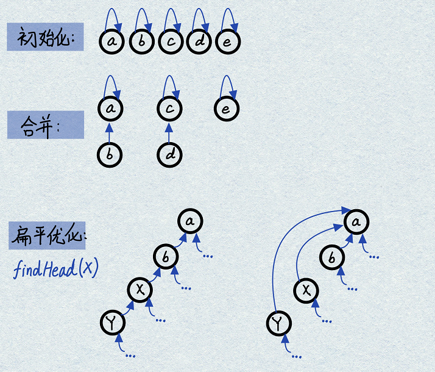
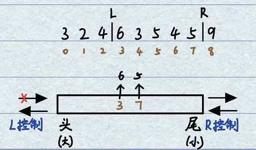
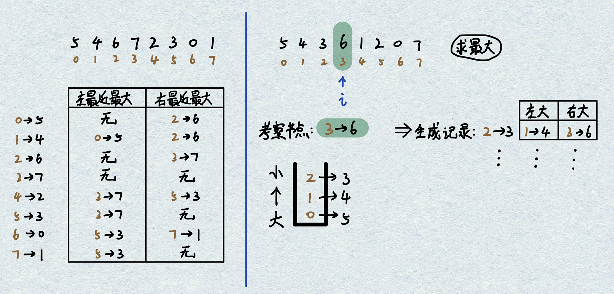
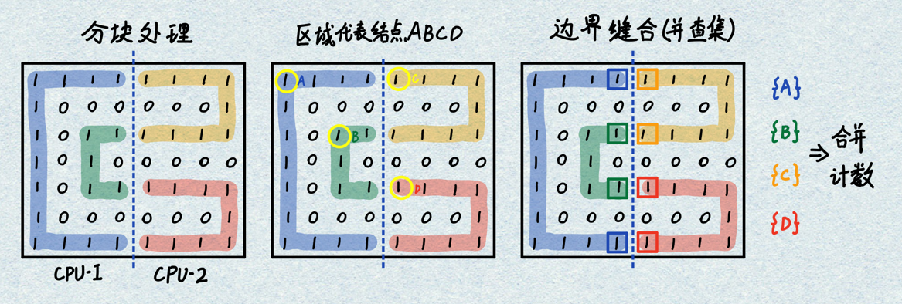

&emsp;&emsp;这些东西是被火车撞了都不能忘的。

# 1.并查集(Union Find)
- **基本概念**：能够支持快速集合合并的基础数据结构，本质上是一个`往上指向`的图结构，伴随索引优化过程。有很多种实现方式可以完成这两个功能，但是想要快速实现此两功能（即O(1)时间复杂度）还是需要靠并查集。如果使用链表实现并查集，则union快但是isSameSet慢；如果使用哈希表实现并查集，则isSameSet快但是union慢。
- **基本功能**：在用户预先给定所有元素的情况下，对外提供两个接口：
    - **bool isSameSet(a, b)**：查询两个元素是否在一个集合内；
    - **void union(a, b)**：将a和b所在的两个集合进行合并。

- **构建过程**：
    - **元素初始化**：对用户给定的所有元素进行二次包装，内部添加指针指向自己；
    - **isSameSet(a, b)**：对两个元素分别进行向上索引一直到最顶端（往上不能再往上），如果为同一元素则说明在同一集合内；
    - **union(a, b)**：先调用isSameSet判断是否在一个集合，若在同集合则不操作；若不在同集合则将短链顶端元素指针指向到长链顶端元素；
    - **findHead(a)扁平优化**：调用isSameSet时存在一个持续向上搜索过程，此过程中蕴含着一个重要优化。因为是以链表的形式索引到顶端元素Top，索引中将所有沿途节点入栈，到达Top元素之后修改所有栈内元素指针统一指向Top，实现集合内元素的扁平化。此优化解决了链过长的问题，只需处理一次即可完成高效查询。
<div align=center>

</div>

- **基于哈希表的实现**：通过哈希表实现元素和父元素的对应，也可以使用链表方法实现。
    - **elementMap(V, E)**：每个值到元素的映射；
    - **fatherMap(E, E)**：每个元素到父元素的映射；
    - **sizeMap(E, int)**：只有顶端元素才有集合元素数量记录。

- **复杂度分析**：并查集结构在1964年被发明，其复杂度在1969年才被证明。设元素数量为N，当调用次数达到O(N)级别和O(N)以上时，单次的平均代价为O(1)。当findHead(a)函数调用次数远远小于N时无法保证O(1)。实际上并不是O(1)，而是O(a(N))，阿尔法函数是一个增长速度极其缓慢的函数（当N为宇宙原子数量10^80次方时a(N)<6），因此日常情况下可以认为复杂度为O(1)。

```java
public static class Element<T> {
    public T value;
    
    public Element(T value) {
        this.value = value;
    }
}

public static class UnionFind<T> {
    public HashMap<T, Element<T>> elementMap; // 值到元素的映射
    public HashMap<Element<T>, Element<T>> fatherMap; // 元素到父节点的映射
    public HashMap<Element<T>, Integer> sizeMap; // 顶端元素的集合数量

    public UnionFind(List<T> dataList) { // 初始化，需要用户给定所有元素
        elementMap = new HashMap<>();
        fatherMap = new HashMap<>();
        sizeMap = new HashMap<>();
        for (T i : dataList) { // 所有元素自成集合
            Element<T> ele = new Element<T>(i);
            elementMap.put(i, ele);
            fatherMap.put(ele, ele);
            sizeMap.put(ele, 1);
        }
    }

    public Element<T> findHead(Element<T> ele) { // 带有扁平化优化的找头节点
        Stack<Element<T>> path = new Stack<>();
        while (ele != fatherMap.get(ele)) {
            path.push(ele); // 沿途节点入栈，待找到顶部节点之后依次修改链接。
            ele = fatherMap.get(ele);
        }
        while (!path.isEmpty()) { // 统一修改链接，扁平化
            fatherMap.put(path.pop(), ele);
        }
        return ele; // 返回顶部元素
    }

    public boolean isSameSet(T a, T b) {
        if (elementMap.containsKey(a) && elementMap.containsKey(b)) { // 不存在就不用找头了
            return findHead(elementMap.get(a)) == findHead(elementMap.get(b));
        }
        return false;
    }

    public void unionSet(T a, T b) {
        if (elementMap.containsKey(a) && elementMap.containsKey(b)) { // 不存在就不用合并了
            if (!isSameSet(a, b)) { // 不在同一个集合才进行合并操作
                Element<T> aF = findHead(elementMap.get(a)); // 找到各自的头部节点
                Element<T> bF = findHead(elementMap.get(b));
                Element<T> bigSet = sizeMap.get(aF) > sizeMap.get(bF) ? aF : bF; // 重定向两个元素
                Element<T> smlSet = bigSet == aF ? bF : aF;
                fatherMap.put(smlSet, bigSet); // 小集合顶部挂载到大集合顶部
                sizeMap.put(bigSet, sizeMap.get(aF) + sizeMap.get(bF)); // 更新大集合的元素数量
                sizeMap.remove(smlSet); // 删除小集合的元素数量记录
            }
        }
    }
}
```

# 2.窗口内Max&Min更新结构
- **基本概念**：以O(N)的代价获取动态窗口内的Max或Min，而硬性遍历会导致O(N^2)的复杂度。
- **窗口原则**：R和L只能单向向右运动，无法回退；R永远在L的右侧；
- **算法实现**：构建一个双端队列即可实现，头部和尾部均可以进出节点。队列内放下标而不是数组中的数字。若要求动态获取Max，则需要一个从大到小排列的双端队列。进出原则如下：
    - **元素进入(R右移)**：尝试从尾部放入队列，若能够`保证严格降序`则直接放入，若无法保证`严格降序`则不断从尾部弹出下标（永远不找回），直至能放入为止；
    - **最大值**：任何时候窗口内部的最大值都是双端队列头部（最左侧）下标对应的数值；
    - **元素弹出(L右移)**：将L下标指向的元素移出窗口时，检查L元素是否是队列头部元素，若是则从头部弹出此下标L，若不是则不做任何操作。
<div align=center>

</div>

- **双端队列内部信息含义**：若此时窗口R固定（不再向右扩张），L依次向右运动时（窗口不断缩减），双端队列内从左到右依次存放着依次过期情况下谁会成为最大值的优先级信息。在R扩张时，新元素E导致双端队列尾部元素弹出，此时弹出的元素再也不可能成为最大值，因此可以无找回删除（新元素晚失效，且值更大）。
- **复杂度分析**：每个元素只进出双端队列1次，所以单次平均代价为O(1)。注意并不代表每次都是O(1)，会存在复杂度的短时峰值。

# 3.单调栈(Monotonous Stack)
- **基本概念**：给定一个数组，对于每一个元素[i]，获取`左边离它最近的比它大的`、`右边距离它最近的比它大的`两个元素。经典方法在每个位置[i]进行双侧遍历导致复杂度为O(N^2)。单调栈结构可以将复杂度降低到O(N)，因为每个元素只进栈出栈各一次。

- **实现方法**：考虑无重复值情况，若求左边最近最大、右边最近最大，则需要构建并维持一个由底至顶从大到小的栈，栈内存放元素下标。
    - **元素入栈**：若栈空或者放入[i]后能够继续维持大小关系，则直接放入；
    - **元素出栈**：若元素[i]无法放入，则开始从栈中弹出元素[j]，每弹出一个元素则生成一条记录，左侧最大信息为栈内下一元素，右侧最大信息为[i]元素。
    - **末尾元素出栈(清算阶段)**：所有元素都已经考察完，但是仍然有一些元素处于单调栈中时，继续按照规则弹出，无右侧最大值。
<div align=center>

</div>

- **合理性分析**：在无重复值情况下，若栈内从大到小依次是[ba，当考察c时发现c>a，此时应当生成a的左右记录。
    - **右侧最近最大值为a的合理性**：若a和c之间存在一个k>a，则a一定会被k释放，而不会轮到c来释放a；
    - **左侧最近最大值为b的合理性**：因为a与b紧邻，所以可以排除掉所有a左侧有其他最大值的可能。

- **存在重复值情况**：在栈内存放链表，将重复值压在链表中，继续按照之前的规则进出栈。注意弹出[j]元素时，左侧最近最大元素是栈内下一链表的末尾元素。弹出某个元素时将链表中所有元素均弹出。

```java
// 栈排布快速记忆方法: 垂直放置，需要Min则Min放下端；需要Max则Max放下端，遵循需要什么就把什么压箱底的思想。
// Get: Min, Min放到栈底          Get: Max, Max放到栈底
//      |Max|                            |Min|
//      |   |                            |   |
//      |   |                            |   |
//      |Min|                            |Max|
//      -----                            -----

// 无重复值：实现左右最近Min值寻找，需要构建一个以大压小的栈。
public static int[][] getNearLessNoRepeat(int[] arr){
    int[][] res = new int[arr.length][2]; // 存放每一个位置的左右结果信息
    Stack<Integer> stack = new Stack<>(); // 创建栈,内部存放下标信息
    for(int i = 0; i < arr.length; i++){ // 遍历每个元素
        while(!stack.isEmpty() && arr[stack.peek()] > arr[i]){ // 保证以大压小
            int popIdx = stack.pop(); // 弹出目标节点
            int leftLessIdx = stack.isEmpty() ? -1 : stack.peek();
            res[popIdx][0] = leftLessIdx; // 左侧有可能为空，需要记录信息
            res[popIdx][1] = i; // 右侧有等待入栈节点，所以一定存在右最小信息
        }
        stack.push(i); // 完成弹出之后入栈i节点
    }
    while(!stack.isEmpty()){ // 整体数组走完一遍但是栈仍然不为空，依次弹出节点
        int popIdx = stack.pop();
        int leftLessIdx = stack.isEmpty() ? -1 : stack.peek();
        res[popIdx][0] = leftLessIdx;
        res[popIdx][1] = -1; // 最后留在栈中的信息一定无右侧信息
    }
}

// 有重复值：实现左右最近Min值寻找，需要构建一个以大压小的栈，栈内存放列表信息。

```

# 题目49.岛问题
- **题目**：一个矩阵只有0和1两种值，每个位置都可以和自己的上下左右四个位置相连，如果有一片1连在一起则被称为一个岛，求一个矩阵中有多少个岛？
```java
001010
111010
100100
000000
// 共有3个岛
```
- **分析**：每个元素逐个分析，使用infect感染过程将每个1片区更改为2片区。外部是两层for循环遍历，内部是infect函数递归更改值。
- **时间复杂度分析**：以每一个元素为中心，其上下左右分别只调用一次，除去第1次修改之外所有情况均是碰到就直接返回。因此复杂度为O(N*M)矩阵规模。

```java
public static void process(int[][] mat, int i, int j) {
    if (i < 0 || i == mat.length || j < 0 || j == mat[0].length || mat[i][j] != 1) {
        // 所有越界情况和0/2情况都直接返回，筛选1情况
        return;
    }
    mat[i][j] = 2;
    process(mat, i - 1, j);
    process(mat, i + 1, j);
    process(mat, i, j - 1);
    process(mat, i, j + 1);
}

public static int island(int[][] mat) {
    int cnt = 0;
    for (int i = 0; i < mat.length; i++) {
        for (int j = 0; j < mat[0].length; j++) {
            if (mat[i][j] == 1) { // 若此位置是1，则岛数量加一，执行感染过程
                cnt++;
                process(mat, i, j); // 以此点为起点开始感染过程
            }
        }
    }
    return cnt;
}

public static void main(String[] args) {
    int[][] mat = { { 1, 0 }, { 0, 1 } };
    System.out.println(island(mat));
}
```

# 题目50.岛问题并行处理(Google级别面试题)
- **题目**：当岛问题的规模非常巨大时，例如对一个高清世界地图进行岛计算，设计一个并行算法解决岛问题。
- **类型分析**：在ACM和面试过程中绝大部分题目是单CPU单内存系统问题，面试阶段有可能碰到并行设计题目。此时不需要代码实现，只需要说清楚思路就可以了。考这样的题目也肯定是google级别的公司了。
- **解题思路**：考虑两个CPU的场景，将矩阵左右分为均等的两块。
<div align=center>

</div>

# 题目51.窗口内Max更新结构
- **题目**：有一个整型数组arr和一个大小为w的窗口，窗口从数组的最左侧滑倒最右侧，每次移动一个位置。返回窗口内最大值构成的数组。
```java
[4 3 5] 4 3 3 6 7
4 [3 5 4] 3 3 6 7
4 3 [5 4 3] 3 6 7
...
最终结果：[5, 5, 5, 4, 6, 7]
```
- **分析**：典型的窗口最大值更新结构，此题目只要求完成固定尺度滑窗。
```java
public static int[] getMaxWindow(int[] arr, int w) {
    if(arr == null || w < 1 || arr.length < w) {
        return null;
    }
    // [{1,2,3},4,5,6] w=3
    LinkedList<Integer> qmax = new LinkedList<>();
    int[] result = new int[arr.length - w + 1]; // 预先定义好结果数组的长度
    int index = 0; // 记录最大值位置
    for (int i = 0; i < arr.length; i++) {
        // R右移：放置新数值，弹出直到符合要求为止
        while(!qmax.isEmpty() && arr[qmax.getLast()] <= arr[i]) {
            qmax.pollLast();
        }
        qmax.addLast(i);
        // L右移共分为两种情况：
        // 1.初始成窗不需要右移L,直接出结果
        // 2.成窗后需要右移L,先考察左端元素,再出结果
        if(qmax.getFirst() == i - w) { // 已经成窗口,L右移. i-w在完成过期的下标弹出.
            qmax.pollFirst();
        }
        if(i >= w - 1) {  // 初始成窗,直接出结果; 窗右移,出结果
            result[index++] = arr[qmax.getFirst()];
        }
    }
    return result;
}
```

# 题目52.单调栈使用
- **题目**：给定一个正数数组，数组中累加和与最小值的乘积定义为指标A。给定一个数组，返回子数组中指标A的最大值。
- **分析**：乍一看这道题和单调栈一毛钱关系没有，但是其实最优解的原型就是来自于单调栈。如果按照从整体枚举所有可能的思想去解题会导致复杂度剧增，因此可以将思路转化为`若以[i]位置为最小，所有可能的子数组中指标A最大的数组一定是最长的`，进而将题目转化为求左右最近最小的单调栈问题。

