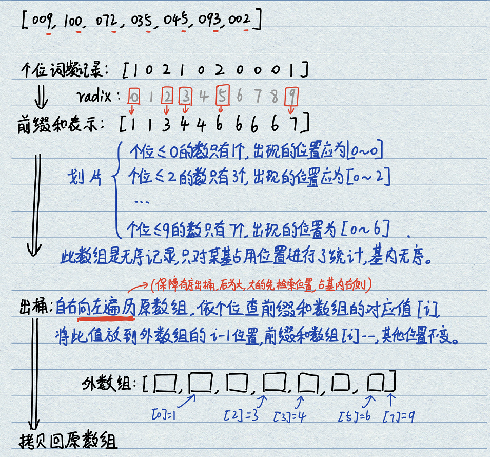
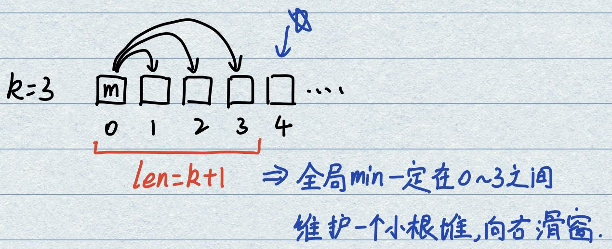

@[TOC](目录)

# 1.时间复杂度基本概念

- **常数操作**：一个操作如果和样本的数据量没有关系，每次都是固定时间内完成的操作，叫做常数操作。  
例如数组寻址取值复杂度为O(1)，可以通过地址+偏移量的形式进行取值。加减乘除、位运算均属于常数操作。  

- **非常数操作**：操作与数据规模有关，例如链表的取值。

- **时间复杂度**：在一个算法流程中，常数操作数量的指标。常用O来表示。此算法流程中发生了多少次常数操作，进而总结出常数操作数量的表达式。  
表达式中只要高阶项，不要低阶项，也不要高阶项的系数（因为高阶项才是真正的瓶颈）。  
评价一个算法流程的好坏，先看时间复杂度指标，再分析不同数据样本下的实际运行时间，即"常数项时间"。

- **额外空间复杂度**：此流程需要多少额外空间才能完成计算。如果是有限变量则为O(1)，如果需要开辟相同大小数组则为O(N)。

# 2.选择排序(Selection Sort)
- **算法流程**：  
1. 输入一个数组；
2. 从0遍历到N-1，找出最小元素所在的位置，和idx=0元素进行交换；
3. 从1遍历到N-1，找出最小元素所在的位置，和idx=1元素进行交换；
4. ...
5. idx和N-1相同时，到达最后一个元素，结束；

- **时间复杂度分析**： 
需要索引的次数为(N-1 + N-2 + ... + 1)，需要比较的次数为(N-1 + N-2 + ... + 1)，需要交换的次数为N，因此时间复杂度为O(N^2)。  
因为在运行过程中只需要记录一个最小索引，所以额外空间复杂度为O(1)。

- **Code**：
```java
public static void selectionSort(int[] arr) {
    if (arr == null || arr.length < 2) { //若长度为0或1，直接返回
        return;
    }
    for (int i = 0; i < arr.length - 1; i++) { //外层循环控制范围下标
        int minIdx = i; //最小元素位置
        for (int j = i + 1; j < arr.length; j++) { //开始逐个比较
            minIdx = arr[j] < arr[minIdx] ? j : minIdx; //锁定最小元素下标
        }
        swap(arr, i, minIdx);
    }
}
public static void swap(int[] arr, int i, int j) {
    int tmp = arr[i];
    arr[i] = arr[j];
    arr[j] = tmp;
}
```

# 3.冒泡排序(Bubble Sort)
- **算法流程**： 
1. 输入一个数组；
2. idx=0开始到idx=N-2 从左到右依次两两比较，如遇右侧数小则交换两数位置，第一轮结束之后最大值放置于N-1的位置；
3. idx=0开始到idx=N-3 从左到右依次两两比较，如遇右侧数小则交换两数位置，第二轮结束之后次大值放置于N-2的位置；
4. ...
5. idx=0开始到idx=1 比较两数大小，如果右侧为小则交换。  
**形象理解**：每过一轮，最大的数都会出现在最右侧。就像最大的泡泡会先沉到最底。

- **时间复杂度分析**： 
时间复杂度O()N^2，额外空间复杂度O(1)。

- **Code**：
```java
public static void bubbleSort(int[] arr) {
    if (arr == null || arr.length < 2) {
        return;
    }
    for (int i = arr.length - 1; i > 0; i--) { // 使用i定义遍历时的右边界，i存放最大元素
        for (int j = 0; j < i; j++) { // 两两比较左侧下标
            if (arr[j] > arr[j + 1]) { // 若出现升序则进行交换
                swap(arr, j, j + 1);
            }
        }
    }
public static void swap(int[] arr, int i, int j) {
    int tmp = arr[i];
    arr[i] = arr[j];
    arr[j] = tmp;
}
```


# 4.插入排序(Insertion Sort)
- **算法流程**： 
这个排序是O(N^2)中最重要的排序算法，可以做到稳定。
1. 输入一个数组；
2. 实现idx=0到idx=0上有序，已经默认完成；
3. 实现idx=0到idx=1上有序，idx=1元素与前面元素逆向逐个比较，若逆序则交换，直到不再逆序或到达边界；
4. 实现idx=0到idx=2上有序，idx=2元素与前面元素逆向逐个比较，若逆序则交换，直到不再逆序或到达边界；
5. ...
6. 实现idx=0到idx=N-1上有序，idx=N-1元素与前面元素逆向逐个比较，若逆序则交换，直到不再逆序或到达边界；

- **时间复杂度分析**：
插入排序的常数操作数量和数据状况相关，而选择排序、冒泡排序和数据状况无关，都是严格的O(N^2)。若一个数组已升序排列则为O(N)，若已降序排列则为O(N^2)。此时按照最差情况计算，时间复杂度为O(N^2)。  
插入排序只需要记录下标i，因此额外空间复杂度为O(1)。

- **Code**：
```java
public static void selectionSort(int[] arr) {
    if (arr == null || arr.length < 2) {
        return;
    }
    for (int e = 1; e < arr.length; e++) { // 外层循环判定右边界
        int i = e;
        while (i != 0 && arr[i] < arr[i - 1]) { // 内层循环：当i不越界且出现逆序时进行交换
            swap(arr, i, i - 1);
            i--;
        }
    }
}
public static void selectionSort(int[] arr) {
    if (arr == null || arr.length < 2) {
        return;
    }
    for (int e = 1; e < arr.length; e++) {
        for (int i = e - 1; i >= 0 && arr[i] > arr[i + 1]; i--) {
            swap(arr, i, i + 1);
        }
    }
}
```  

# 5.二分法
二分法可以用在多个场景下，并不一定只适用于有序数组判断某个数字存在与否。注意：边界条件比较难分析！
1. 题目1：有序数组找特定数;
```java
public static boolean ifExist(int[] arr, int num) {
    if (arr == null || arr.length == 0) {
        return false;
    }
    int L = 0; //初始化左指针
    int R = arr.length - 1; //初始化右指针
    int mid = 0; //初始化中间指针
    
    while(L < R) { //若满足L在R的左侧，持续寻找
        mid = L + ((R - L) >> 1); // 计算mid位置
        if(arr[mid] == num) { // 若等于则直接找到
            return true;
        } else if (arr[mid] < num){ // 若数在mid的右侧则更新L
            L = mid + 1;
        } else { // 若数在mid的左侧则更新R
            R = mid -1;
        }
    }
    // 如果遇到终结条件则直接跳出，不在while内处理
    // 分析后可发现，while内放置L<R这样的写法，在找到最后的情况下，会使得最后L和R相等
    return arr[L] == num; // 当L>=R时，判断最后元素是否为此数值
}
```
2. 题目2：有序有重复数组找某数，且在最左侧，例如[1,1,1,1,2',2,2,2,3,3,3,3,];
```java
public static int ifExist_left(int[] arr, int num) {
    if (arr == null || arr.length == 0) {
        return -1;
    }
    int L = 0; // 初始化左指针
    int R = arr.length - 1; // 初始化右指针
    int mid = 0; // 初始化中间指针

    while (L < R) { // 若满足L在R的左侧，持续寻找
        mid = L + ((R - L) >> 1); // 计算mid位置
        if (arr[mid] == num) { // 若等于则直接找到，但并不一定是最优，因此更新右边界
            R = mid;
        } else if (arr[mid] < num) { // 若数在mid的右侧则更新L
            L = mid + 1;
        } else { // 若数在mid的左侧则更新R
            R = mid - 1;
        }
    }
    // 如果遇到终结条件则直接跳出，不在while内处理
    if (arr[L] == num) {
        return L;
    } else {
        return -1;
    }
}
public static void main(String[] args) {
    int arr[] = { 1, 1, 1, 1, 1, 2, 2, 3, 4, 5 };
    int res = ifExist_left(arr, 5);
    System.out.println(res);
}

//左神代码
public class Code05_BSNearLeft {
	// 在arr上，找满足>=value的最左位置
	public static int nearestIndex(int[] arr, int value) {
		int L = 0;
		int R = arr.length - 1;
		int index = -1;
		while (L <= R) {
			int mid = L + ((R - L) >> 1);
			if (arr[mid] >= value) {
				index = mid;
				R = mid - 1;
			} else {
				L = mid + 1;
			}
		}
		return index;
	}
}
```
3. 题目3：局部最小值问题，无序数组中相邻两个数一定不相等，找出一个低谷即可。  
先判断idx=0和idx=N-1是否为局部最小，如果是则直接返回；  
如果起始和结尾都非最小，则其中一定存在拐点，取中点判断，是局部最小则返回；
若中点非局部最小，进行二分查找  
基于循环写二分难点在于边界条件！这个使用开区间还是闭区间比较难把握！
```java
public static int FindOneLessValueIndex(int[] arr) {
    if (arr == null || arr.length <= 1) {
        return -1;
    }
    // 首先判断起始和结尾
    if (arr[0] < arr[1]) {
        return 0;
    }
    if (arr[arr.length - 2] > arr[arr.length - 1]) {
        return arr.length - 1;
    }
    //
    int L = 0; // 左右指针都指向边界，都是开区间。都是不可能为目标值的位置。
    int R = arr.length - 1;
    int mid = 0;

    while (L < R) {
        mid = L + ((R - L) >> 1);
        if(arr[mid] < arr[mid - 1] && arr[mid] < arr[mid + 1]) { // 此点为局部最小点
            return mid; // 返回下标
        } else if(arr[mid] < arr[mid - 1]) { // 左方较大，选取右半边
            L = mid; // 向右压缩寻找空间
        } else if(arr[mid] > arr[mid - 1]) { // 左方较小，选取左半边
            R = mid; // 向右压缩寻找空间
        }
    }
    return mid;
}

// for test
public static void main(String[] args) {
    int arr[] = { 5, -10, 3, 2, 1, 100, 1, 3, -10, 5 };
    int res = FindOneLessValueIndex(arr);
    System.out.println(res);
}
```

# 6.递归时间复杂度分析
- **master公式**：剖析递归行为和递归行为时间复杂度的估算。  
$$T(N) = a * T\left (\frac{N}{d}\right ) + O(N^d)$$  
$T(N)$为母问题的数据量，N级别规模；等式右侧为递归行为的细节，$T(N/d)$指示这些子问题等规模。$a$为子问题的调用次数。$O(N^d)$为除了子问题的调用之外剩下过程的时间复杂度。只要满足子问题等规模的递归，都可以使用master公式直接求复杂度：  
$$ \log_{b}{a} < d, O(N^d) $$
$$ \log_{b}{a} > d, O(N^{\log_{b}{a}}) $$
$$ \log_{b}{a} = d, O(N^d * \log{N}) $$

# 7.归并排序(Merge Sort)
- **算法流程**：一个非常重要的排序，基于分治法和外排序，可以做到稳定。
1. 选取中间点，分别完成两侧排序；
2. 开辟额外内存空间，使用双指针分别完成两个分立部分元素的拷贝；
3. 从额外的内存空间中拷贝回来数值。

- **时间复杂度分析**：
使用master公式：
$$ T(N) = 2*T\left(\frac{N}{2}\right) + O(N) $$
每次都二分，因此a和b均为2；每次merge操作中都需要完成元素的外拷贝与回拷贝，因此为$O(N)$。满足master公式三种情况中的$\log_{a}{b} = d$，因此复杂度为$O(N*\log N)$
额外空间复杂度为$O(N)$，因为每次子过程都会释放，最多准备N个元素的空间。  

为什么Merge Sort是$O(N*\log{N})$，而不是选择/冒泡/插入排序的$O(N^2)$？  
上述排序每一轮只能选出一个最小的数，有大量的比较都被浪费了。而Merge Sort没有浪费比较行为，两个有序部分在融合过程中保存了原始信息，所以可以达到$O(N*\log{N})$。

- **重要性**：
Merge Sort最大的优点在于：使用递归&归并实现区域内不重复比较，最终实现高效持续扩展。能够被应用于数组的大小循环找值问题，将复杂度从$O(N^2)$降低到$O(N*\log{N})$。

- **Code**：
```java
public static void selectionSort(int[] arr) {
    if (arr == null || arr.length < 2) {
        return;
    }
    process(arr, 0, arr.length - 1);
}

public static void process(int[] arr, int L, int R) {
    if (L == R) {
        return;
    }
    int mid = L + ((R - L) >> 1); // 锁定中点
    process(arr, L, mid); // 完成左侧排序
    process(arr, mid + 1, R); // 完成右侧排序
    merge(arr, L, mid, R); // 对两侧排好序的序列进行归并
}

public static void merge(int[] arr, int L, int mid, int R) {
    int[] help = new int[R - L + 1]; // 构建外排序数组
    int h = 0; // 用于help的下标索引
    int i = L; // 左侧待合并数组索引
    int j = mid + 1; // 右侧待合并数组索引
    while ((i <= mid) && (j <= R)) { // 若两个都不越界
        // 左侧小于等于右侧，先拷贝左侧，维持原始顺序。运行结束之后下标自增
        help[h++] = arr[i] <= arr[j] ? arr[i++] : arr[j++];
    }
    while (i <= mid) { // 若左侧未索引完全
        help[h++] = arr[i++];
    }
    while (j <= R) { // 若右侧未索引完全
        help[h++] = arr[j++];
    }
    for (int cp = 0; cp <= R - L; cp++) { // 从外数组中搬运回原数组
        arr[cp + L] = help[cp];
    }
}
```

# 8.快速排序(Quick Sort)
- **算法流程**：  
**快排V1.0**:在某一个区域中，总是取最后一个数num为划分依据，将整体分为<=num和>num部分；将num和>num区域中第一个位置相交换，完成此数的插入；递归进行，最终可以使得全部有序。  
**快排V2.0**:利用荷兰国旗三色解法。在某一个区域中，总是取最后一个数num为划分依据，将整体分为<num、=num和>num部分；将最后的num和>num区域中第一个位置相交换，完成此数的插入；之后在<和>区域内完成递归。相较于V1.0要快一些，因为每次可以搞定一批数。    
**快排V3.0**:采用随机采数方法，首先将随机p和最后一个元素交换，完成划分。好情况和坏情况都是等概率事件。求数学期望可以得到算法复杂度为$O(N*\log{N})$

- **复杂度分析**：  
**时间复杂度**：不管V1.0还是V2.0，面对最差情况时间复杂度都为$O(N^2)$。例如[1,2,3,4,5,6,7,8,9]每次取最后的元素划分时都需要过一遍前面所有的数字。原因在于每次的划分值打的太偏，导快排退化为$O(N^2)$的算法。当划分值在中间时才是最优情况，复杂度为$T(N)=2*T(N/2)+O(N) = O(N*\log{N})$。  
**额外空间复杂度**：属于$O(\log{N})$级别。最差情况下需要进行N次压栈，每次压栈时都需要记录等于区域的左右范围，因此最差为$O(N)$；最好情况下需要进行$\log{N}$次压栈，次数为一个完全二叉树的高度，因此最好为$O(\log{N})$。快排V3.0的选值属于随机行为，因此求期望可以得到额外空间复杂度为$O(\log{N})$。

- **Code**： 
提示：写递归第一步是先考虑顶层母问题+顶层子问题，确定整个的递归结构之后，再考虑底层子问题。
```java
//此代码在左神的实现中使用了两层递归，比这个代码更加精简。
public static void quickSort(int[] arr) {
    if (arr == null) { return; }
    partition(arr, 0, arr.length - 1);
}

public static void partition(int[] arr, int L, int R) {
    if (L >= R) { // 若下标相等或相反，则是单元素状况，直接返回
        return; // 此处的return相当于叶子节点的终结者
    }

    // 随机找一个数字，和末尾数字进行交换
    int p = L + (int) ((R - L + 1) * Math.random());
    swap(arr, p, R);

    // 开始解决荷兰国旗问题
    int l = L - 1; // 小域边界，闭区间。注意此时在L和R范围内进行排序，所以基数是L，而不是0
    int r = R; // 大域边界，闭区间
    p = L;
    while (p < r) {
        if (arr[p] == arr[R]) { // 若相等则只有p++
            p++;
        } else if (arr[p] < arr[R]) { // 若出现小值，交换[p]和小域右边界+1
            swap(arr, p++, ++l);
        } else { // 若出现大值
            swap(arr, p, --r);
        }
    }

    swap(arr, R, r++); // 将此值插入到大域右边界

    // 结束之后在剩下的两个区间内，继续递归解决
    partition(arr, L, l);
    partition(arr, r, R);
}
```
```java
public static void quickSort(int[] arr, int L, int R) {
    if (L < R) {
        // 随机找一个数字，和末尾数字进行交换
        int p = L + (int) ((R - L + 1) * Math.random());
        swap(arr, p, R);

        // 解决荷兰国旗问题，返回等于区域的边界
        int[] l_r = partition(arr, L, R);
        quickSort(arr, L, l_r[0]);
        quickSort(arr, l_r[1], R);
    }
}

public static int[] partition(int[] arr, int L, int R) {
    // 开始解决荷兰国旗问题
    int l = L - 1; // 小域边界，闭区间
    int r = R; // 大域边界，闭区间
    int p = L;
    while (p < r) {
        if (arr[p] == arr[R]) { // 若相等则只有p++
            p++;
        } else if (arr[p] < arr[R]) { // 若出现小值，交换[p]和小域右边界+1
            swap(arr, p++, ++l);
        } else { // 若出现大值
            swap(arr, p, --r);
        }
    }
    swap(arr, R, r++); // 将此值插入到大域右边界
    
    // 返回等于num区域的左右边界，对于等于来说是开区间3],5,5,5,[6
    return new int[] { l, r };
}
```

# 9.堆结构
- **完全二叉树**：
堆在结构上是一个`完全二叉树`，即要么是`满二叉树`，要么是`从左往右逐渐变满的二叉树`。  
将数组从0开始的一段位置对应（脑补）成为一个完全二叉树。满足如下对应关系：
    - 若元素格式为s，下标从0到s-1；
    - 对于一个元素i，其左孩子下标为`2*i+1`，若越界则无左孩子；其右孩子下标为`2*i+2`，若越界则无右孩子；
    - 对于一个元素i，其父下标为`(i-1)/2`；

- **堆/优先级队列**：
堆是一种比较特殊的完全二叉树，自身具备大小关系，分为`大根堆`和`小根堆`。每一棵子树（以某一个元素为头节点）的最大值都在头节点则为`大根堆`。需要将一颗完全二叉树变换为堆，则为堆排序。堆结构最重要的两个基本操作为`HeapInsert`和`Heapify`，其余所有都是两个操作的变种。

- **HeapInsert过程**：一个s=0的数组，每次用户新增一个元素，堆结构都需要自己实时调整顺序，保证是一个大根堆。流程如下：
    - 新增第一个数字，s=1，放入[0]；
    - 新增第二个数字，s=2，放入[1]，和其父节点进行比较，若num>[(i-1)/2]则和其父节点进行交换。
    - 新增第N个数字，s=N，放入[N-1]，和其父节点不断进行比较，若大于则交换，直到不大于父节点。
    ```java
    public static void heapInsert(int[] arr, int index) {
		while (arr[index] > arr[(index - 1) / 2]) { // 若大于父节点，执行交换操作。当到达0节点，则退出循环。
			swap(arr, index, (index - 1) /2);
			index = (index - 1)/2 ; // 指向父节点
		}
	}
    ```

- **Heapify过程**：在一个已经构建好的大根堆中返回最大值并移除，调整堆结构保证是一个大根堆。流程如下：
    - 返回[0]数值，将最末尾元素[s-1]覆盖[0]，s--使末尾数字失效；
    - 将[0]和自己的两个孩子进行比较，如果自己小于max(left,right)则和大孩子交换；直到没有孩子/比左右孩子都大才停止。
    ```java
    public static void heapify(int[] arr, int idx, int heapsize){ // idx指示从哪个位置开始heapify，将后面的所有数转化为一个大根堆。
        int l_c = idx * 2 + 1; // 左孩子下标
        while (l_c < heapsize){ // 存在左孩子
            // 左右之中挑选最大孩子下标
            int max_c = l_c + 1 < heapsize && arr[l_c] < arr[l_c + 1] ? l_c + 1 : l_c; 
            if (arr[idx] < arr[max_c]) { // 父比子小，需要交换
                swap(arr, idx, max_c);
                idx = max_c; // 父下标更新为最大孩子下标
                l_c = idx * 2 + 1 // 更新左孩子下标
            } else { // 父>=最大子，已经到位置，直接退出
                break;
            }
        }
    }
    ```

- **用户随意修改有效区中的数值**：[----i---,***]中将[i]改为num。此时如何调整整个堆使得保持大根堆？  
方法：如果[i]>num，num向下经历一个heapify；如果[i]<num，向上经历一个heapInsert。

- **时间复杂度**：给定一个新数字插入，或者删除一个数重新调整的代价都是二叉树的高度$O(\log{N})$。是一种非常优秀的结构。


# 10.堆排序(Heap Sort)
**注意**：堆排序远远没有堆结构重要。`优先级队列结构`就是堆结构，不是队列！堆顶就是优先级最大的。

- **算法流程V1.0-逐个插入版**：将排序过程视为在线调整算法，用户动态给定每一个数值，算法需要构建并维持一个大根堆。大根堆的生成过程过程可以视为HeapInsert；生成之后的弹出过程（最大值与末尾值交换，s--缩小堆的区域）可以视为Heapify。
    - 用户给定一个值，默认放在完全二叉树最末尾位置，通过HeapInsert不断向上比较，完成插入；
    - 完成所有值插入之后，将[0]最大值与末尾位置[s-1]进行交换，最大值放置在[s-1]位置，完成排序，s--。
    - 紧接上一步，将[0]处的值向下插入到合适的位置，即Heapify操作。

- **V1.0复杂度分析**：按照V1.0方法，HeapInsert建立大根堆的复杂度为$O(N*\log{N})$，Heapify调整时复杂度依然为$O(N*\log{N})$。额外空间复杂度为$O(1)$，没有使用递归，只需要使用有限几个变量。在$O(N*\log{N})$的所有排序算法中，只有堆排序能够做到$O(1)$的额外空间复杂度。  
Merge Sort额外空间复杂度为$O(N)$；Quick Sort额外空间复杂度为$O(N*\log{N})$，而且还是计算期望的结果。

- **算法流程V2.0-一次性构建堆方法**：将需要排序的数组一次性给定，将其想象为一颗完全二叉树。从叶子节点开始遍历完成自底至顶的Heapify过程。

- **V2.0复杂度分析**：设有N个元素，叶子节点的数量为N/2，此层操作数为1；倒数第二层的数量为N/4，此层进行Heapify需要操作数为2；倒数第三层的数量为N/4，此层进行Heapify需要操作数为3，以此类推。
$$T(N) = \frac{N}{2} + 2*\frac{N}{4} + 3*\frac{N}{8} + 4*\frac{N}{16} + 5*\frac{N}{32} + \cdots$$
原式乘二，和自身错位相减得：
$$T(N) = \frac{N}{2} + \frac{N}{4} + \frac{N}{8} + \frac{N}{16} + \frac{N}{32} + \cdots  = O(N)$$
这样能够将构造过程从原始的$O(N*\log{N})$降到O(N)，可以快一点点。  
<div align=center>

</div> 

- **Code**：
```java
public static void heapSort(int[] arr) {
    if (arr == null || arr.length < 2) { return; }
    for(int i = 0; i < arr.length; i++) { // 构建一个大根堆
        heapInsert(arr, i);
    }
    for(int i = 0; i < arr.length; i++) { // 交换最大值，开始进行heapify
        swap(arr, 0, arr.length - 1 - i); // 最大值放到最右侧
        heapify(arr, 0, arr.length - 1 - i); // 头部节点经历heapify过程
    }
}

public static void heapInsert(int[] arr, int idx) {
    while (arr[idx] > arr[(idx - 1) / 2]) { // 若大于父节点，执行交换操作。当到达0节点，则退出循环。
        swap(arr, idx, (idx - 1) / 2);
        idx = (idx - 1) / 2; // 指向父节点
    }
}

public static void heapify(int[] arr, int idx, int size) {
    int l_c = 2 * idx + 1; // 左孩子
    while(l_c < size) { // 左孩子不越界，一定有孩子，可以进行对比
        // 左右孩子进行pk
        int max_c = l_c + 1 < size && arr[l_c + 1] > arr[l_c] ? l_c + 1 : l_c;
        if (arr[idx] < arr[max_c]) { // 父比某一个孩子小
            swap(arr, idx, max_c);
            idx = max_c;
            l_c = 2 * idx + 1;
        } else { break; }
    }
}
```

# 11.桶排序(Bucket Sort)
之前所有排序都是`基于比较的排序`，桶排序不基于比较。可以分为`计数排序法`和`基数排序法`。此类排序方法都需要根据实际数据状况进行定制，属于一路非常窄的排序算法，不像比较排序那样具有普遍性。

- **计数排序法**：对员工年龄（Integer）进行排序，可以准备一个额外长度为201的列表，下标为0-200。遍历一遍数组完成词频统计，再进行还原即可得到排好序的数组。时间复杂度为$O(N)$。

- **基数排序法(Radix Sort)**：
基数排序比计数排序要好，因为不需要创造所有数字的词频表，规模较小。  
基数排序的思想是：按照最高位数创建桶，从个位开始对全部数字进行单轮入桶出桶，直到位数结束。  
低位数字最先排序，优先级最低；高位数字最后排序，优先级最高。先从低位开始，数组元素依次入桶，再依次出桶。循环操作到高位即可完成整体排序。     

常规的基数排序代码实现要基于Radix个队列桶，而左神给的代码首先创建了一个词频表，通过前缀和数组（划片）的方式巧妙的避开了桶的创建、入桶出桶操作。  
<div align=center>

</div> 

```java
public static void radixSort(int[] arr, int radix) {
    int[] sum_arr = new int[radix]; // 创建前缀和数组
    int[] new_arr = new int[arr.length]; // 创建外数组

    /* 找出数组中的最大值，求位数，确定桶排序运行次数 */
    int MAX_VALUE = Integer.MIN_VALUE;
    for (int i = 0; i < arr.length; i++) {
        MAX_VALUE = MAX_VALUE < arr[i] ? arr[i] : MAX_VALUE;
    }
    int max_iter = 0;
    while (MAX_VALUE != 0) {
        MAX_VALUE /= 10;
        max_iter++;
    }

    /* 单轮桶排序 */
    for (int r = 0; r < max_iter; r++) {
        for (int i = 0; i < radix; i++) { // 前缀和数组清零
            sum_arr[i] = 0;
        }
        for (int i = 0; i < arr.length; i++) { // 数组遍历，统计词频
            sum_arr[arr[i] / (int) Math.pow(10,r) % 10]++; // 挨个取最低位，统计词频
        }
        for (int i = 1; i < radix; i++) { // 制作前缀和数组
            sum_arr[i] += sum_arr[i - 1];
        }
        int idx = 0; // 逆序遍历数组，进行放置
        for (int i = arr.length - 1; i >= 0; i--) {
            idx = arr[i] / (int) Math.pow(10,r) % 10;
            new_arr[--sum_arr[idx]] = arr[i];
        }
        for (int i = 0; i < arr.length; i++) { // 每次排序完成，拷贝回原数组
            arr[i] = new_arr[i];
        }
    }
}
```

- **Code**：

# 12.排序算法总结
- `选择排序`(Selection Sort)：时间复杂度$O(N^2)$，额外空间复杂度$O(1)$，不断找最小值和初始位置交换，导致丧失稳定性。
- `冒泡排序`(Bubble Sort)：时间复杂度$O(N^2)$，额外空间复杂度$O(1)$，两两相比，具备有稳定性。
- `插入排序`(Insertion Sort)：时间复杂度$O(N^2)$，额外空间复杂度$O(1)$，新元素往左两两相比，具备有稳定性
- `归并排序`(Merge Sort)：时间复杂度$O(N*\log{N})$，额外空间复杂度$O(N)$，归并时先拷贝左侧元素即可保证稳定性。
- `快速排序`(Quick Sort)：随机状况下时间复杂度$O(N*\log{N})$，额外空间复杂度$O(\log{N})$，partition过程中远距离交换会导致快排丧失稳定性。
- `堆排序`(Heap Sort)：时间复杂度$O(N*\log{N})$，额外空间复杂度$O(1)$，无稳定性。
- `桶排序`(Bucket Sort)：时间复杂度$O(N)$，先入桶则先出桶，可以保持稳定性。

**O(N*logN)排序比较**  
一般的排序使用`快速排序`，经过实验测定常数项时间相对较短；在额外空间复杂度要求较高的情况下使用`堆排序`；`归并排序`特点是具有稳定性。  

**结论**：  
- (1) 基于比较的排序，无法做到时间复杂度在$O(N*\log{N})$以下。  
- (2) 基于比较的排序，复杂度为$O(N*\log{N})$，无法做到空间复杂度小于$O(N)$且具备稳定性。  

**排序的工程改进**：  
*综合排序*：在大数据量的前提下，利用快排的思想进行调度，分别对左部分和右部分进行递归；在小数据量的前提下（60左右），使用插入排序完成排序（因为瓶颈不明显）。这样的拼接整体调度采用了快排时间复杂度低的优势、局部采用了插入排序常数项低的优势。
```java
public static void quickSort(int[] arr, int l, int r){
    if (l == r) {return;}
    if (l > r - 60){
        // 在arr[l...r]插入排序
        // O(N^2)小样本量的时候跑得快
        return;
    }
    swap(arr, l + (int) (Math.random() * (r - l + 1)), r);
    int[] p = partition(arr, l, r);
    quickSort(arr, l, p[0] - l);
    quickSort(arr, p[1] + l, r);
}
```

*稳定性考虑*：如果是基础类型数据，则系统会自动调用快排，因为常数项时间小；如果是结构体数据，则系统会调用归并，支持稳定性。

**常见的坑**：  
- (1) 归并排序的额外空间复杂度可以变为$O(1)$，但是非常难，不需要掌握，“归并排序 内部缓存法”会导致不稳定，还不如使用堆排序；  
- (2) “原地归并排序”的帖子都是垃圾，会导致时间复杂度变为$O(N^2)$；  
- (3) 快速排序可以做到稳定性，但是非常难，不需要掌握，“01 stable sort”会导致额外空间复杂度提升到$O(N)$，还不如直接使用归并；
- (4) 要求奇数放在左边，偶数放在右边，要求具有稳定性、额外空间复杂度$O(1)$、时间复杂度$O(N)$。

# 对数器
在没有OJ的情况下进行算法测试的方法，可以做到万无一失。  
需要准备:被测算法A、暴力实现算法B、随机数据发生器。

# 比较器
java比较器的实质就是`重载比较运算符`(C++中的称谓，改写什么叫小于号、大于号)，可以很好应用在特殊标准的排序上(Sort算法)，也可以很好的应用在根据特殊标准排序的结构上(完成从小根堆到大根堆的转换、完成结构体数据复杂比较逻辑的实现)。

```java
/* 用在特殊标准的排序上 */
Integer[] arr = {5, 4, 3, 2, 1};
Arrays.sort(arr, new IdAscendingComparator()); // 数组默认从小到大排列，如果传入比较器则按照比较器进行排序
public static class IdAscendingComparator implements Comparator<Student> {
    // 返回负数，小值排前面，保持原有顺序
    // 返回正数，大指排前面，需要交换两指位置
    // 返回0，顺序无所谓
    @Override
    public int compare(Student o1, Student o2){
        return o1.id - o2.id; // ID递增排序
        return o2.id - o1.id; // ID递减排序
        return o1.age - o2.age; // Age递增排序
        return o2.age - o1.age; // Age递减排序
    }
}

/* 用在特殊标准排序的结构上(Heap) */
public static class AComp implements Comparator<Student>{ 
    // 若实现一个大根堆：
    // 返回负数，arg1小，则arg0应该放到堆的上侧
    // 返回正数，arg1大，则arg1应该放在堆的上侧
    // 返回0，谁在上侧无所谓

    @Override
    public int compare(Student arg0, Student arg1){
        return arg1.id - arg0.id; // arg0 - arg1是默认的小根堆写法
    }
}

PriorityQueue<Student> maxHeapBasedId = new PriorityQueue<>(new AComp);
maxHeapBasedId.add(student1);
maxHeapBasedId.add(student2);
maxHeapBasedId.add(student3);

/* 复杂排序逻辑的简易实现 */
// 结构体中有多种类型的数据，整体按照某一指标排序，局部按照另一指标排序。可以使用比较器轻易实现。

```


# 题01:异或运算实现两数交换
异或运算可以理解为"无进位相加"。  
异或运算性质：
1. 0^N=N N^N=0
2. 满足交换律和结合律。（通过"无进位相加"进行理解，某位的结果与此位置出现奇数偶数次数相关）
3. 无序性：同样一批数和某个数异或，不论顺序均可得到结果

```C++
/*注意：这样做一定要保证a和b是两个不同变量！如果两者内存相同，会将其抹为0*/
/*属于抖机灵的写法，不建议这么做，交换使用temp即可*/
int a = 17; // a=甲
int b = 23; // b=乙
a = a^b; // a=甲^乙 b=乙
b = a^b; // a=甲^乙 b=甲^乙^乙=甲^0=甲
a = a^b; // a=(甲^乙)^甲=乙 b=甲
```

# 题02:出现奇数次数的元素选取
- **题目**： 一个整型数组arr中，只有一种数出现了奇数次，其余出现偶数次，要求在时间复杂度O(N)，额外空间复杂度O(1)内找出此数；一个整型数组arr中，只有两种数出现了奇数次，其余出现偶数次，要求在时间复杂度O(N)，额外空间复杂度O(1)内找出此数。

- **分析**：出现偶数次的数字通过异或之后会变成0，只有出现奇数次的元素会被剩下，可以求解第一题；  
第二题中，  
1.从头异或到尾可以得到a^b，此结果一定不为0（因为题目说明是两种数），则结果中至少有一位不为0。  
2.假设第8位为1，则证明a和b在8位一定不同。通过第8位的0/1对所有数进行阵营划分，此时a或b一定会分开阵营。某一阵营内部全部异或可以得到a or b。  
3.使用1得到的(a^b)和2得到的(a/b)进行异或，即可得到另一个数。

- **Code**：
```java
public static void printOddTimesNum1(int[] arr) {
    int result = 0;
    for (int i = 0; i < arr.length; i++) { // 其余都为偶数次，所以可以一直异或，直至剩下奇数
        result ^= arr[i];
    }
    System.out.println(result);
}
int[] arr1 = { 3, 3, 2, 3, 1, 1, 1, 3, 1, 1, 1 };
printOddTimesNum1(arr1);
```
```java
public static void printOddTimesNum2(int[] arr) {
    int result_all = 0;
    for (int i = 0; i < arr.length; i++) {
        result_all ^= arr[i]; // 从头异或到尾，最终结果为a^b
    }
    int tag = result_all & (~result_all + 1); // 选择a^b结果中最右侧的1，生成00001000
    int a = 0;
    for (int i = 0; i < arr.length; i++) {
        if ((tag & arr[i]) == 0) { // 使用此数字按位异或整个数组，进行分隔，对其中一类进行全部异或
            a ^= arr[i]; // 对一部分进行全部异或之后即可得到a或b
        }
    }
    int b = result_all ^ a; // 根据a^b^a=b即可得到b
    System.out.println(a);
    System.out.println(b);
}
int[] arr2 = { 4, 3, 4, 2, 2, 2, 4, 1, 1, 1, 3, 3, 1, 1, 1, 4, 2, 2 };
printOddTimesNum2(arr2);
```

- **Tips**：
将一个不为0的数字最右侧的1提取出来，剩下的位置都为0：此数取反加一和自身相与。
```C++
int right_one = a & (~a + 1)
// 11110010 & (00001101 + 1) = 11110010 & 00001110 = 00000010
```

# 题03:递归版本数组最大值
- **题目**：使用递归方法求解数组中的最大值。

- **分析**：需要绘制递归结构图，必须知道所有叶子节点才能够向上层返回值。本质上是一个二叉树的遍历，是一个不断压栈的过程。栈空间就是整棵树的高度。

- **Code**
```java
public static int getMax(int[] arr) {
    return process(arr, 0, arr.length - 1);
}

public static int process(int[] arr, int L, int R) {
    if (L == R) {
        return arr[L]; //递归到L和R重合时，直接返回此位置的值
    }
    // 使用计算偏移量的方式，防止溢出。使用位移代替除法。
    int mid = L + ((R - L) >> 1); 
    int L_max = process(arr, L, mid);
    int R_max = process(arr, mid + 1, R);

    return Math.max(L_max, R_max);
}
```

- **时间复杂度分析**：按照master公式，调用次数为2，子问题规模为$N/2$，子问题时间复杂度为$O(1)$，因此为：
$$T(N) = 2*T\left( \frac{N}{2} \right) + O(1)$$
按照master公式，$\log_{2}{2} = 1 > d$，因此复杂度为$O(N^1)$，等价于遍历。

- **Tips**：数组下标求中点时，如果数组过长会导致溢出，因此需要稳妥的求中点方法。  
```java
int mid = L + ((R - L) >> 1) //右减左，之后右移一位，最终加上左下标。
```

# 题04:小和问题-归并排序的深度改写
- **题目**：一个数组中，每一个数左边比当前数小的数累加起来，叫做这个数组的小和。使用$O(N*\log{N})$复杂度计算小和。  
例子：[1,3,4,2,5]的小和为(1)+(1+3)+(1)+(1+3+4+2)=16。

- **分析**：
如果使用双层循环方法，则时间复杂度会是$O(N^2)$。  
等价思想：锁定一个数向左求小和，等价于，锁定一个数计算右侧比它大的元素的个数。可以利用Merge Sort中的归并过程完成小和累加。  
唯一差别：左组和右组相等时一定优先拷贝右组，同时进行排序。这样不会算漏，也不会算重。

- **Code**
```java
public static int little_sum(int[] arr) {
    if (arr == null || arr.length <= 1) {
        return -1;
    }
    return process(arr, 0, arr.length - 1);
}

public static int process(int[] arr, int L, int R) {
    if (L == R) {
        return 0; // 递归到叶子节点位置，直接返回
    }
    int sum_l = 0;
    int sum_r = 0;
    int sum_merge = 0;

    int mid = L + ((R - L) >> 1);
    sum_l = process(arr, L, mid); // 左侧排序求小和
    sum_r = process(arr, mid + 1, R); // 右侧排序求小和
    sum_merge = merge(arr, L, mid, R); // 左侧排好、右侧排好，整体merge时的小和
    return sum_l + sum_r + sum_merge; // 需要将三个部分的sum进行相加
}

public static int merge(int[] arr, int L, int mid, int R) {
    int[] help = new int[R - L + 1];
    int h = 0;
    int i = L; // 左指针
    int j = mid + 1; // 右指针

    int l_sum = 0; // 此次merge得到的小和

    while (i <= mid && j <= R) { // 若都不越界，一直循环
        if (arr[i] >= arr[j]) { // 若左侧i大于等于右侧，则先拷贝右侧，且不计算小和
            help[h++] = arr[j++];
        } else if (arr[i] < arr[j]) { // 找到右侧最小的，比arr[i]大的数，此时使用O(1)方法计算小和个数。
            l_sum += (R - j + 1) * arr[i]; // 计算小和之后左指针i++，向右移动。
            help[h++] = arr[i++]; // 计算完小和之后需要拷贝
        }
        // 左神精简代码：
        // l_sum += arr[i] < arr[j] ? (R - j + 1) * arr[i] : 0; // 右侧开始有严格大于数值时求小和，否则不求；
        // help[h++] = arr[i] < arr[j] ? arr[i++] : arr[j++];
    }
    while (i <= mid) { // 左侧未越界
        help[h++] = arr[i++];
    }
    while (j <= R) { // 右侧未越界
        help[h++] = arr[j++];
    }

    for (int p = 0; p < R - L + 1; p++) { // 向回完成拷贝
        arr[L + p] = help[p];
    }

    return l_sum;
}

public static void main(String[] args) {
    int arr[] = { 1, 3, 4, 2, 5 };
    int res = little_sum(arr);
    System.out.println(res);
}
```

# 题05:荷兰国旗问题-快排的思想来源
- **题目**：
(1)给定一个数组arr和一个数num，将<=num的数放在数组左侧，>num的数放在数组右侧。要求额外空间复杂度$O(1)$，时间复杂度$O(N)$。  
(2)同上，将<num的数放左侧，=num的数放中间，>num的数放右侧。要求额外空间复杂度$O(1)$，时间复杂度$O(N)$。  

- **分析**：
(1)创建两个下标b和i，b指示小域的闭区间右边界，i指示索引数值；若[i]<=num则交换[b+1]和[i]位置的数值，b和i同时加一；若[i]>num则i继续往前走。

- **Code**
```java
public static void flag(int[] arr, int num) {
    if (arr == null || arr.length == 1) { return; }
    int b = -1; // 小域右边界，闭区间
    for (int i = 0; i < arr.length; i++) { // i遍历每一个数字
        if (arr[i] <= num) { // 若遇到小于等于num的数，则进行交换
            swap(arr, b + 1, i); // 当前数和小域闭边界+1进行交换
            b++; // 交换一次则小域扩充一次
        }
    }
}

public static void swap(int[] arr, int i, int j) {
    if (i == j) { return; } // 相等则不交换
    int temp = arr[i];
    arr[i] = arr[j];
    arr[j] = temp;
}

public static void main(String[] args) {
    int arr[] = { 10, 3, 3, 4, 2, 5, 2, 2, 2, 2 };
    flag(arr, 3);
    for (int i = 0; i < arr.length; i++) { System.out.println(arr[i]); }
}
```

```java
public static void flag(int[] arr, int num) {
    if (arr == null || arr.length == 1) {
        return;
    }
    int i = 0;
    int L = -1;
    int R = arr.length;

    while (i != R) {
        if(arr[i] == num) { // 相等，直接i++，等于区域向右扩充
            i++;
        } else if (arr[i] < num) { // 发现小值，小域边界加1位置和此最小值交换，
            swap(arr, i++, ++L);
        } else { // 发现大数，大域边界减1位置和此最大值交换，i保持不变
            swap(arr, i, --R);
        }
    }
}

public static void swap(int[] arr, int i, int j) {
    if (i == j) { return; } // 相等则不交换
    int temp = arr[i];
    arr[i] = arr[j];
    arr[j] = temp;
}

public static void main(String[] args) {
    int arr[] = { 10, 3, 3, 4, 2, 5, 2, 2, 2, 2, 3, 3 };
    flag(arr, 3);
    for (int i = 0; i < arr.length; i++) { System.out.println(arr[i]);}
	}
```

# 题06:数字位置在有有序有限范围内，实现整体排序
- **题目**：已知一个几乎有序的数组，几乎有序是指，如果把数组排好顺序的话，每个元素移动的距离可以不超过k，并且k相对于数组来说比较小。请选择一个合适的排序算法针对这个数据进行排序。

- **分析**：准备一个小根堆，构建一个长度为k+1的滑窗，此滑窗内的最小值位置一定会被固定在最左侧（优先级队列弹出最小值，压入新值）。之后向右滑动窗口，最小值依然放到最左侧。如此反复到数组右端。逐步弹出最小值即可。因为每次调整堆的复杂度为$O(\log{k})$，最终的复杂度为$O(N*\log{k})$。

- **注意**：java内部的PriorityQueue使用默认参数会构建小根堆。只能够支持基础add()和poll()操作，两个操作的复杂度都为$O(\log{N})$。系统提供的PriorityQueue不支持高效的单值变动与堆调整，只能支持单点的遍历调整，如果需要自动的向上HeapInsert和向下Heapify操作则需要自己实现！（属于一个黑盒模型，功能就是你给他一个，他给你一个，不要在内部搞东搞西。）  
堆在不够用时会进行扩容操作，进行成倍扩容。  

- **编程难点**：需要考虑数据长度比滑窗小的情况，滑窗构建起始和末尾的过程都要考虑清楚。此代码使用了idx标记滑窗右边界，使用i标记滑窗左边界。

<div align=center>

</div>

- **Code**
```java
public static void sortedArrDistanceLessK(int[] arr, int k) {
		PriorityQueue<Integer> heap = new PriorityQueue<>();
		//先完成堆构建
		int idx = 0; // 索引使用
		for(;idx < Math.min(k, arr.length); idx++) { // 需要考虑len<k的情况
			heap.add(arr[idx]); // 需要构建一个长度为k的滑窗
		}
		int i = 0;
		for(; idx < arr.length; i++, idx++) { // 右边界到达末尾时停止此循环
			heap.add(arr[idx]); // 新增一个，达到k+1滑窗
			arr[i] = heap.poll(); // 弹出一个，到窗最左侧，保持k长度
		}
		while(!heap.isEmpty()) {
			arr[i++] = heap.poll();
		}		
	}
```

# 题07：面试官要搞你-奇偶划分问题
- **题目**：要求奇数放在左边，偶数放在右边，要求具有稳定性、额外空间复杂度$O(1)$、时间复杂度$O(N)$。

- **分析**：快排的partion过程中，需要把<=N的数放左边，>N的数放右边，即0-1 partion问题。经典快排的partion做不到稳定性，因此无法完成。若要分开且不改变相对位置关系非常难办到，01 stable sort论文可以实现。

